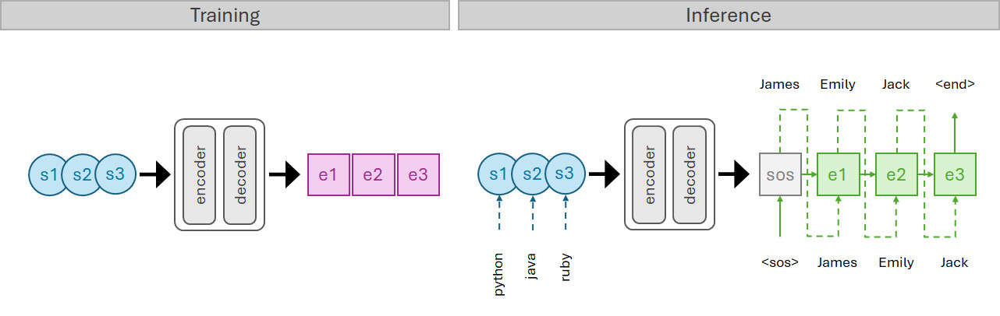

# `OpeNTF`: Translative Neural Team Recommendation

This repository contains the code implementation for our research paper "Translative Neural Team Recommendation" (SIGIR 2025). The paper proposes a novel approach to team recommendation by treating it as a neural machine translation problem, where individual member skills and characteristics are translated into optimal team compositions. Our method leverages state-of-the-art sequence-to-sequence (seq2seq) neural machine translation (NMT) architectures such as the Transformer and RNN with attention and convolutional model, and the [OpenNMT-py](https://github.com/OpenNMT/OpenNMT-py) framework to capture complex relationships between team members and project requirements, leading to more effective team formation recommendations.
<br/>
<br/>
> 
> Overview of the sequence-to-sequence architecture.

<br/>
<br/>


## Workflow Overview 

1. Set up environment
2. Run the models.
3. Collect the results.

<br/>

## 1. Set up environment

Three ways to run our pipeline:

- 1.1. The Docker approach (recommended)
- 1.2. The virtual environment approach (i.e., `venv` or conda `env`)
- 1.3. Without any of the above

<br/>

### 1.1. The Docker approach (recommended)

- #### 1.1.1. Download and install Docker from here: [Get Docker | Docker Docs](https://docs.docker.com/get-started/get-docker/)


- #### 1.1.2. Once your docker is up and running, pull our a ready-made image from the Docker Hub with this command. It's about 26 GB.
    ```
    docker pull kmthang/opennmt
    ```
    > Note: you may need to login first using `docker login` command.

<br/>

- #### 1.1.3. Once downloaded, create a container from it with:
    ```
    docker run -it -d --name container_name --hostname host_name --gpus all -v $(pwd):/OpeNTF kmthang/opennmt
    ```
    > Note: run the above command while in root repository which is the `/OpeNTF` folder. You can change the `container_name` and `host_name` to whatever you like.

<br/>

- #### 1.1.4. Connect to the container by this command:
    ```
    docker attach container_name
    ```


- #### 1.1.5. Run the bash script
    ```
    ./run_scripts/nmt_model.sh
    ```
    > Example
    ```
    container_name@hostname:/OpeNTF/run_scripts# ./nmt_model.sh
    ```

<br/>


### 1.2. The virtual environment approaches

- #### 1.2.1. Python venv
    ```
    ./setup_venv.sh
    ```

- #### 1.2.2. virtualenv
    ```
    ./setup_virtualenv.sh
    ```

- #### 1.2.3. Conda env
    ```
    ./setup_conda.sh
    ```

<br />

### 1.3. Without any of the above

- #### 1.3.1. Install the dependencies either one of the following:
    ```
    pip install -r requirements.txt
    ```


<br />


## 2. Creating a new NMT model

Duplicate one of the three templates available in `src/mdl/nmt_models/` folder and prefix your model with `nmt_`:
  > Available templates
  - `_template_transformer.yml`
  - `_template_rnn.yml`
  - `_template_cnn.yml`
  

  > Example
  ```
  nmt_mycnn_model.yaml
  ```

Modify the hyperparameters and other settings you wish such as data paths, training steps, hidden size, batch size, number of layers, number of GPUs to use, etc.

<br />


## 3. Create a new bash script

#### 3.1. Duplicate a latest bash script template in `/run_scripts` folder and rename the file name to something else (no need to prefix with `nmt_`):
  > Example
  ```
  mycnn_model.sh
  ```

<br/>


#### 3.2. In the bash script, edit the configurations to match your model name and dataset name. You only need to edit the `# CONFIGURATIONS` section.

    > Example
    ```bash
    # ------------------------------------------------------------------------------
    # CONFIGURATIONS
    # ONLY EDIT THIS SECTION

    # GPU indices to use for training
    gpus_to_use="6,7"

    # models to run located in the src/mdl/nmt_models directory
    models=("mode1")

    # Used if use_dataset_in_filename is false
    datasets=("dblp")

    run_next_script=false
    next_script_name="example_next_script.sh"
    ```

    Now you can run the bash script with:
    ```
    ./mycnn_model.sh
    ```
    
<br />


## 5. Automating multiple models and datasets

In the configuration section of the bash script, you can specify multiple models and datasets to run. For example:
```
models=("mode1" "mode2")
datasets=("dblp" "imdb")
```

This will run the following in top to bottom order:
- `mode1` on `dblp` dataset.
- `mode1` on `imdb` dataset.
- `mode2` on `dblp` dataset.
- `mode2` on `imdb` dataset.


