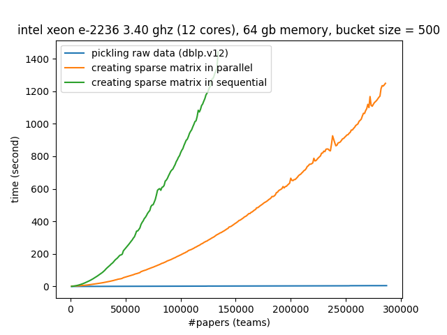

# Neural Team Formation 
Teams are the primary vehicle for coordinating experts with diverse skills needed for a particular collaborative project, and Team Formation (TF) has firsthand effects on creating organizational performance. Social network analysis has been employed for TF by incorporating social ties and interpersonal collaboration features using measures such as degree and closeness centrality. Socially driven methods, however, face two significant challenges, esp., when currency (timeliness) is of the prime concern: ``i) temporality``: the expert's skills and her social attributes constantly change over time. A successful collaboration of experts in a team years ago does not tailor a successful team now, ``ii) Complexity``: optimum teams are found by computationally expensive search over all the subgraphs of a large-scale collaboration graph (search-based.) 

## Objectives
We propose ``neural machine learning`` approaches to Team Formation. We will train neural models that would learn relationships among experts and their social attributes in vector space. Wherein, we consider all past (un)successful team compositions as training samples to predict future teams and the team's level of success. Therefore, we bring efficiency while enhancing efficacy due to the inherently iterative and online learning procedure in neural architectures. More importantly, we will address temporality by incorporating sequences on the neural architecture via recurrence, which yields a richer representation and more accurate team composition within time. We are the first who consider temporal graph neural networks for team formation and will provide major advances via ``1) time-sensitive`` and ``2) scalable`` incorporation of experts' attributes and skills. 

1. [Setup](#1-setup)
2. [Quickstart](#2-quickstart)
3. [Features](#3-features)
4. [Results](#4-results)
5. [Acknowledgement](#5-acknowledgement)
6. [License](#6-license)

## 1. Setup
You need to have ``Python >= 3.8`` and install the following main packages, among others listed in [``requirements.txt``](requirements.txt):
```
torch==1.6.0
pytre_eval==0.5
gensim==3.8.3
```
By ``pip``, clone the codebase and install the required packages:
```sh
git clone https://github.com/Fani-Lab/neural_team_formation
cd neural_team_formation
pip install -r requirements.txt
```
By [``conda``](https://www.anaconda.com/products/individual):

```sh
git clone https://github.com/Fani-Lab/neural_team_formation
cd neural_team_formation
conda env create -f environment.yml
conda activate ntf
```

For installation of specific version of a python package due to, e.g., ``CUDA`` versions compatibility, one can edit [``requirements.txt``](requirements.txt) or [``environment.yml``](environment.yml) like as follows:

```
# CUDA 10.1
torch==1.6.0+cu101 -f https://download.pytorch.org/whl/torch_stable.html
```
## 2. Quickstart

```sh
cd src
python main.py -data=data/raw/dblp/toy.dblp.v12.json -domain=dblp -model=fnn
```

The above run, loads and preprocesses a tiny-size toy example dataset [``toy.dblp.v12.json``](data/raw/dblp/toy.dblp.v12.json) from [``dblp``](https://originalstatic.aminer.cn/misc/dblp.v12.7z) followed by 5-fold train-evaluation on a training split and final test on the test set for a simple feedforward neural model using default hyperparameters from [``./src/param.py``](./src/param.py).

## 3. Features:
**Data Loading and Parallel Preprocessing**

Raw dataset, e.g., scholarly papers from [AMiner](https://www.aminer.org/) 's citation network dataset of [``dblp``](https://originalstatic.aminer.cn/misc/dblp.v12.7z) or movies from [``imdb``](https://datasets.imdbws.com/), were assumed to be populated in [``data/raw``](data/raw). For the sake of integration test, a tiny-size toy example dataset [``toy.dblp.v12.json``](data/raw/dblp/toy.dblp.v12.json) from [``dblp``](https://originalstatic.aminer.cn/misc/dblp.v12.7z) and [[``toy.title.basics.tsv``](data/raw/imdb/toy.title.basics.tsv), [``toy.title.principals.tsv``](data/raw/imdb/toy.title.principals.tsv), [``toy.name.basics.tsv``](data/raw/imdb/toy.name.basics.tsv)] from [``imdb``](https://datasets.imdbws.com/) have been already provided.

Raw data will be preprocessed into two main ``sparse`` matrices each row of which represents: 

>i) ``vecs['member']``: occurrence (boolean) vector representation for members of a team, e.g., authors of a paper or crew members of a movie,
> 
>ii) ``vecs['skill']``: occurrence (boolean) vector representation for required skills for a team, e.g., keywords of a paper or genre of a movie.

Also, indexes will be created to map the vector's indexes to members' names and skills' names, i.e., ``i2c``, ``c2i``, ``i2s``, ``s2i``.

The sparse matrices and the indices will be persisted in [``data/preprocessed/{dblp,imdb,uspt}/{name of dataset}``](data/preprocessed/) as pickles ``teamsvecs.pkl`` and ``indexes.pkl``. For example, the preprocessed data for our dblp toy example are [``data/preprocessed/dblp/toy.dblp.v12.json/teamsvecs.pkl``](data/preprocessed/dblp/toy.dblp.v12.json/teams.pkl) and [``data/preprocessed/dblp/toy.dblp.v12.json/indexes.pkl``](data/preprocessed/dblp/toy.dblp.v12.json/indexes.pkl).

> Our pipeline benefits from parallel generation of sparse matrices for teams that significantly reduces the preprocessing time as shown below:
> 
> <p align="center"></p>


Please note that the preprocessing step will be executed once. Subsequent runs load the persisted pickle files. In order to regenerate them, one should simply delete them. 

**[Train][Validation][Test] Split**

We randomly take ``85%`` of the dataset for the train-validation set and ``15%`` as the test set, i.e., the model never sees these instances during training or model tuning. You can change ``train_test_split`` parameter in [``./src/param.py``](./src/param.py).

We use _n_-fold cross-validation, that is, we train a model _n_ times on _(n-1)_ folds and utilize the remaining fold as the validation set to adjust the learning rate during training. The number of folds is set by ``nfolds`` in [``./src/param.py``](./src/param.py). In total, we have _n_ models each of which will be evaluated on the test set.

At each run, we store ids of instances in train-validation folds and test set in [``./data/preprocessed/{dblp,imdb,uspt}/{name of dataset}/splits.json``](data/preprocessed/) like in [``./data/preprocessed/dblp/toy.dblp.v12.json/splits.json``](./data/preprocessed/dblp/toy.dblp.v12.json/splits.json)

**Model Architecture**

Each model has been defined in [``./src/mdl/``](./src/mdl/) and realized in a submain pipeline that can be executed for ``train``, ``test``, ``eval``, and ``plot`` steps. 
For example, for our feedforward baseline [``fnn``](./src/mdl/fnn.py), the pipeline has been implemented in [``./src/mdl/fnn.py``](src/mdl/fnn.py) which is realized in [``./src/fnn_main.py``](src/fnn_main.py). Model's hyperparameters such as the learning rate (``lr``) or the number of epochs (``e``) can be set in [``./src/param.py``](src/param.py).

Currently, we support neural models:
1) Baysian [``bnn``](./src/mdl/bnn.py) where model's parameter (weights) is assumed to be drawn from Gaussian (Normal) distribution and the task is to not to learn the weight but the mean (μ) and standard deviation (σ) of the distribution at each parameter.
2) non-Baysian feedforward [``fnn``](./src/mdl/fnn.py) where the model's parameter (weights) is to be learnt.

The input to the models is the vector representations for skills and the output is the vector representation for members. In another word, given the input skills, the models predict the members from the pool of candidates. We support two vector representations:
1) Sparse vector representation (occurrence or boolean vector): See preprocessing section above.
2) Dense vector representation ([``team2vec``](./src/mdl/team2vec.py)): Inspired by paragraph vectors by [Le and Mikolov](https://cs.stanford.edu/~quocle/paragraph_vector.pdf), we consider a team as a document and skills as the document words (``embtype == 'skill'``). Using distributed memory model, we map skills into a real-valued embedding space. Likewise and separately, we consider members as the document words and map members into real-valued vectors (``embtype == 'member'``). We also consider mapping skills and members into the same embedding space (``embtype == 'joint'``). Our embedding method benefits from [``gensim``](https://radimrehurek.com/gensim/) library.

**Negative Sampling Strategies**

As known, employing ``unsuccessful`` teams convey complementary negative signals to the model to alleviate the long-tail problem. Most real-world training datasets in the team formation domain, however, do not have explicit unsuccessful teams (e.g., collections of rejected papers.) In the absence of unsuccessful training instances, we proposed negative sampling strategies based on the ``closed-world`` assumption where no currently known successful group of experts for the required skills is assumed to be unsuccessful.  We study the effect of ``three`` different negative sampling strategies: two based on static distributions, and one based on adaptive noise distribution:

1) Uniform distribution (``uniform``), where subsets of experts are randomly chosen with the ``same probability`` as unsuccessful teams from the uniform distribution over all subsets of experts.

2) Unigram distribution (``unigram``), where subsets of experts are chosen regarding ``their frequency`` in all previous successful teams. Intuitively, teams of experts that have been more successful but for other skill subsets will be given a higher probability and chosen more frequently as a negative sample to dampen the effect of popularity bias.

3) Smoothed unigram distribution in each training minibatch (``unigram_b``), where we employed the ``add-1 or Laplace smoothing`` when computing the unigram distribution of the experts but in each training minibatch. Minibatch stochastic gradient descent is the _de facto_ method for neural models where the data is split into batches of data, each of which is sent to the model for the partial calculation to speed up training while maintaining high accuracy. 

To include a negative sampling strategy, there are two parameters for a model to set in [``./src/param.py``](src/param.py):
- ``ns``: the negative sampling strategy which can be ``uniform``, ``unigram``, ``unigram_b`` or ``None``(no negative sampling).
- ``nns``: number of negative samples

**Run**

The pipeline accepts three required input values:
1) ``-data``: the path to the raw datafile, e.g., ``-data=./../data/raw/dblp/dblp.v12.json``, or the main file of a dataset, e.g., ``-data=./../data/raw/imdb/title.basics.tsv``
2) ``-domain``: the domain of the raw data file that could be ``dblp``, ``imdb``, or `uspt`; e.g., ``-domain=dblp``.
3) ``-model``: the baseline model that could be ``fnn``, ``fnn_emb``, ``bnn``, ``bnn_emb``, ``random``; e.g., ``-model=fnn`` 

## 4. Results:

We used [``pytrec_eval``](https://github.com/cvangysel/pytrec_eval) to evaluate the performance of models on the test set as well as on their own train sets (should overfit) and validation sets. We report the predictions, evaluation metrics on each test instance, and average on all test instances in ``./output/{dataset name}/{model name}/{model's running setting}/``.  For example for our toy dataset:

1) [``f0.test.pred``](./output/toy.dblp.v12.json/fnn/t30.s11.m12.l[100].lr0.1.b4096.e100/f0.test.pred) is the predictions per test instance for a model which is trained folds [1,2,3,4] and validated on fold [0].
2) [``f0.test.pred.eval.csv``](./output/toy.dblp.v12.json/fnn/t30.s11.m12.l[100].lr0.1.b4096.e100/f0.test.pred.eval.csv) is the values of evaluation metrics for the predictions per test instance
3) [``f0.test.pred.eval.mean.csv``](./output/toy.dblp.v12.json/fnn/t30.s11.m12.l[100].lr0.1.b4096.e100/f0.test.pred.eval.mean.csv) is the average of values for evaluation metrics over all test instances.
4) [``test.pred.eval.mean.csv``](./output/toy.dblp.v12.json/fnn/t30.s11.m12.l[100].lr0.1.b4096.e100/test.pred.eval.mean.csv) is the average of values for evaluation metrics over all _n_ fold models.

**Benchmarks at Scale**

||min. #member's team: 75, min team size: 3, epochs: 20, learning rate: 0.1, hidden layer: [1, 100d], minibath: 4096, #negative samples: 3|
|--------|------|
|Datasets|[dblp.v13](https://originalstatic.aminer.cn/misc/dblp.v12.7z), [imdb](imdb.com/interfaces/)|
|Metrics|recall@2,5,10, map@2,5,10, ndcg@2,5,10, p@2,5,10, auc|
|Baselines|{fnn,bnn}×{sparse, emb}×{none, uniform, unigram, unigram_b}|
|Results|[``./output/dblp.v12.json.filtered.mt75.ts3/``](./output/dblp.v12.json.filtered.mt75.ts3/), [``./output/title.basics.tsv.filtered.mt75.ts3/``](./output/title.basics.tsv.filtered.mt75.ts3/)|

<p align="center">


Full predictions of all models on test and training sets and the values of evaluation metrics, per instance and average, are available in a rar file of size ``74.8GB`` and will be delivered upon request! 

## 5. Acknowledgement:
We benefit from [``pytrec_eval``](https://github.com/cvangysel/pytrec_eval), [``gensim``](https://radimrehurek.com/gensim/), [Josh Feldman's blog](https://joshfeldman.net/WeightUncertainty/), and other libraries. We would like to thank the authors of these libraries and helpful resources.
  
## 6. License:
©2021. This work is licensed under a [CC BY-NC-SA 4.0](LICENSE.txt) license.
