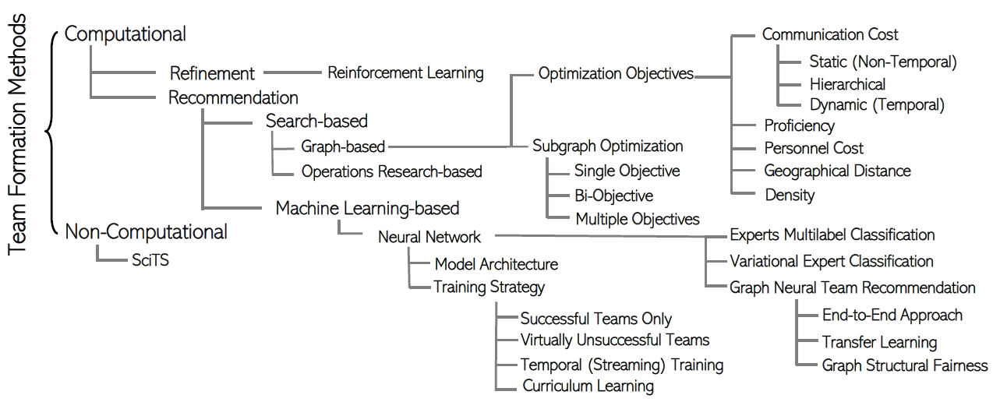
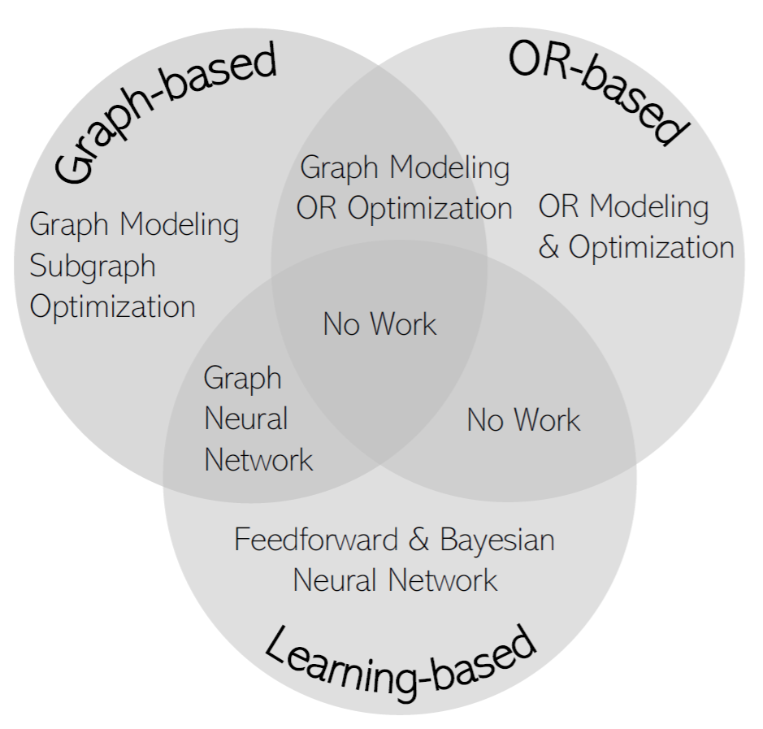

## Team Formation Strategies

  
  
<em>Figure1: A taxonomy of the computational Expert Team Formation methods.</em>

Team formarion involves selecting skillful experts to form an *almost surely* successful team (optimum team) or refining the team composition in some domains like sports teams to maintain or improve performance. Computational team formation approaches can be distinguished based on the optimization techniques: i) search-based, where the search for a successful team is by finding the subgraphs of an expert graph using subgraph optimization methods, or it is performed on subsets of experts as variants of the set cover problem [^1][^2][^3]  using operations research (OR) techniques such as integer linear/nonlinear programming, and ii) learning-based, where machine learning approaches are used to learn the distributions of experts and skills in the context of previous (un)successful teams in order to recommend future successful teams.

Within the search-based category, operations research, optimizes the mutually independent selection of experts, overlooking the organizational and collaborative ties among individuals [^1][^4][^5][^6]. However, graph-based approaches view teams as inherently relational, emphasizing the importance of expert interactions and collaboration. Moreover, learning-based methods have been proposed to bring efficiency while enhancing efficacy due to their iterative and online learning procedure [^7][^8]. As seen in Figure 2, there is an overlap between team formation approaches. As an instance, graph-based and operations research-based methods, where optimization functions have been defined based on linear or nonlinear equation of Boolean variables representing edges on the expert graph [^9]. Additionally, learning-based methods utilize the expert graph to learn vector representations of skills using graph neural networks (GNNs), which helps reduce the complexity of neural models at the input layer [^12]. Specifically, graph neural networks [^10][^11] provide an effective and efficient general framework for solving graph analytics problems by converting a graph into a low-dimensional vector space while preserving its graph-structured information. Having demonstrated strong performances across a wide range of problems, including natural language processing [^13], knowledge graphs [^14] and recommender systems [^15], graph neural networks are gradually finding their application in Expert Team Formation [^12]. 

  

[^1]: M. Muniz et al. A column generation approach for the team formation problem. https://www.sciencedirect.com/science/article/pii/S0305054823002708.
[^2]: A. Anagnostopoulos et al. Power in unity: forming teams in large-scale community systems. https://dl.acm.org/doi/pdf/10.1145/1871437.1871515.
[^3]: E. Fitzpatrick et al. Forming effective worker teams with multi-functional skill requirements. https://www.sciencedirect.com/science/article/pii/S0360835204002049.
[^4]: E. H. Durfee et al. Using hybrid scheduling for the semi-autonomous formation of expert teams. https://www.sciencedirect.com/science/article/pii/S0167739X1300068X.
[^5]: S. J. Kalayathankal et al. A modified fuzzy approach to project team selection. https://www.sciencedirect.com/science/article/pii/S2666222121000022. 
[^6]: L. Wang et al. Team Recommendation Using Order-Based Fuzzy Integral and NSGA-II in StarCraft. https://ieeexplore.ieee.org/stamp/stamp.jsp?arnumber=9044841.
[^7]: R. Hamidi Rad et al. PyTFL: A Python-based Neural Team Formation Toolkit. https://dl.acm.org/doi/pdf/10.1145/3459637.3481992.
[^8]: A. Dashti et al. Effective Neural Team Formation via Negative Samples. https://dl.acm.org/doi/pdf/10.1145/3511808.3557590.
[^9]: M. B. Campelo et al. The sociotechnical teams formation problem: a mathematical optimization approach. https://link.springer.com/content/pdf/10.1007/s10479-018-2759-5.pdf.
[^10]: R. Bing et al. Heterogeneous graph neural networks analysis: a survey of techniques. https://link.springer.com/content/pdf/10.1007/s10462-022-10375-2.pdf. 
[^11]: Z. Wu et al. A Comprehensive Survey on Graph Neural Networks. https://ieeexplore.ieee.org/stamp/stamp.jsp?arnumber=9046288.
[^12]: H. Nguyen et al. Learning heterogeneous subgraph representations for team discovery. https://link.springer.com/content/pdf/10.1007/s10791-023-09421-6.pdf.
[^13]: L. Wu et al. Graph Neural Networks for Natural Language Processing: A Survey. https://www.nowpublishers.com/article/Details/MAL-096.
[^14]: Z. Ye et al. A Comprehensive Survey of Graph Neural Networks for Knowledge Graphs. https://ieeexplore.ieee.org/stamp/stamp.jsp?arnumber=9831453.
[^15]: S. Wu et al. Graph Neural Networks in Recommender Systems: A Survey. https://dl.acm.org/doi/pdf/10.1145/3535101.
[^16]:
