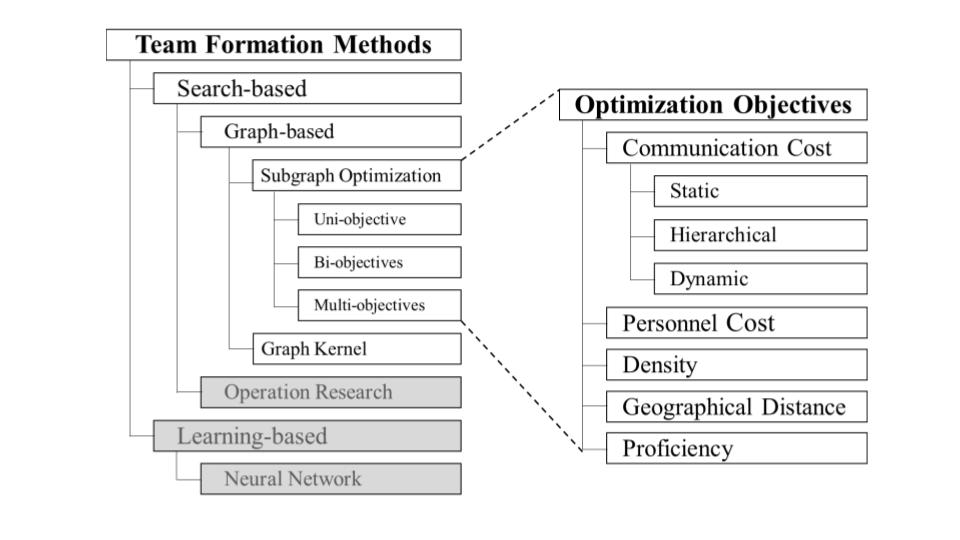

## A Survey of Subgraph Optimization for Collaborative Team Formation: Objectives, Techniques, and Critics
The search for gathering a team of experts who are expected to collaboratively work towards accomplishing a given
project successfully is referred to as Team Formation, a problem that has historically been solved in a variety of
ways including manually in a time-consuming and bias-filled manner, and, algorithmically within such disciplines as
social sciences, management, operations technology, and so forth. In the present effort, while providing a taxonomy to
distinguish between search-based versus learning-based approaches, we survey the graph-based Team Formation studies
from the search-based category, motivated as they comprise the mainstream. We present a unifying and vetted overview
of the various definitions of the notions in this realm, scrutinize assumptions and benchmarks, and identify shortfalls.
We start by drawing upon initial efforts and approaches to the problem of Team Formation to lay the conceptual
foundations and set forth the necessary notions for a more grounded view of this realm. Next, with the help of a
specifically designed set of notations, we provide a detailed view of the graph-based Team Formation approaches based
on the objective functions they aim to optimize. In doing so, we lay out who builds on whom and how algorithms have
evolved to solve previous works’ drawbacks. Additionally, we categorize different evaluation schemes and elaborate on
different metrics and the insights that can be drawn from each. Referring to the evaluation schemas and metrics, we
compare different works and propose future directions.

Our survey brings forth a unifying and vetted methodology to the various definitions of the notions in this realm, criticizes assumptions and comparative benchmarks,
and points out shortfalls to smooth the path for future research directions.
In this survey, we present a novel taxonomy from a computational perspective:


We present a comprehensive overview of 18 seminal graph-based solutions to the Team Formation problem, 
including 13 proposed optimization objectives, after screening 63 algorithms from 126 papers. 
The examined papers in this survey can be categorized as follows:
```
─categirized_papers
      ├───capacity_of_team_members
      ├───constraint
      │   ├───authority
      │   ├───communication_cost
      │   │   ├───buttleneck
      │   │   ├───dense
      │   │   ├───diameter
      │   │   ├───graph_clustering
      │   │   ├───stainertree
      │   │   └───sum_of_edge_weight
      │   ├───geographical proximity
      │   ├───trust
      │   └───workload
      ├───dynamic_network
      ├───efficiency
      ├───fairness
      ├───grouped_team
      ├───keyword_search_and_community_search
      ├───learning_based
      │   ├───game_theory
      │   └───learning_search_based
      ├───multi_objectiver
      ├───number_of_created_teams
      │   ├───more_than _one
      │   │   ├───pareto_set
      │   │   └───top_k
      │   └───one
      ├───old
      │   ├───education
      │   ├───engineering
      │   ├───multi_skill_heuristic_solution
      │   ├───network
      │   ├───performance
      │   └───team_member_characteristic
      ├───operation_research
      │   ├───fuzzy
      │   ├───genetic_algorithm
      │   ├───hierarchical
      │   ├───integer_programming
      │   └───linear_programming
      ├───similarity_between_two_graphs
      │   ├───graph_pattern
      │   └───kernel_replacing_a_member
      ├───surveys
      ├───team with leader
      └───team_size
          ├───at_least_k_person_for_each_skill
          ├───at_most_k_responsiblity_for_each_person
          └───small_teams
```


