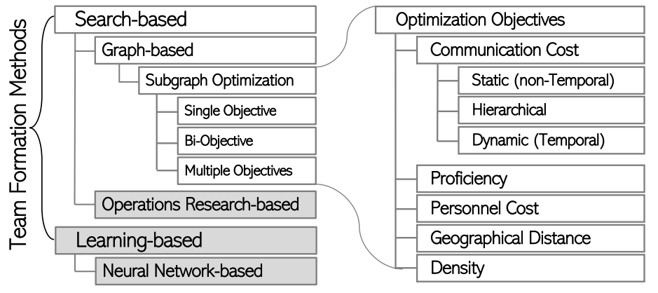
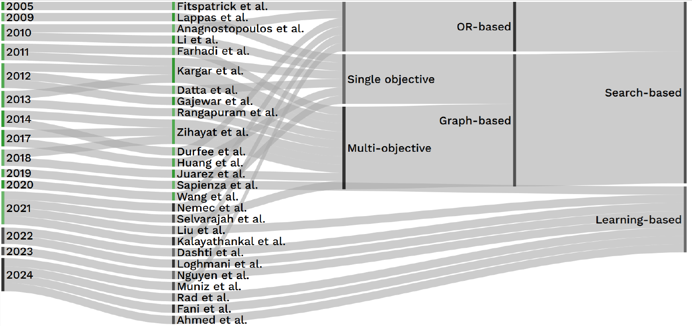
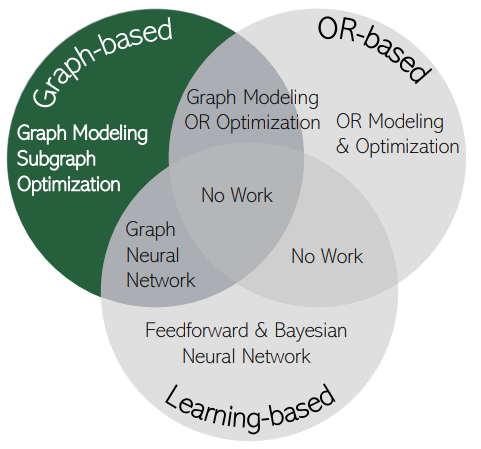

This repository contains supplementary materials for our published survey paper:


<h1 align="center" style="border-bottom: none;">
  <a href="https://[example.com](https://hosseinfani.github.io/res/papers/2025_CSUR_A_Survey_of_Subgraph_Optimization_for_Expert_Team_Formation.pdf)"><strong>A Survey of Subgraph Optimization for Expert Team Formation</strong></a>
</h1>

 **Journal Highlight** 

> **[ACM Computing Surveys](https://dl.acm.org/journal/csur):**
      
    
> **Impact Factor:**
23.8

> **H-Index:**
232

> **Ranking:**
1st out of 143 journals in Computer Science – Theory & Methods   

  
 **Timeline**  

> **Started:**
June 5, 2021


> **Submitted:**
November 22, 2023

> **[First Round Review:](https://hosseinfani.github.io/res/papers/2025_CSUR_R1_A_Survey_of_Subgraph_Optimization_for_Expert_Team_Formation.pdf)**
October 11, 2024

> **[Second Round Review:](https://hosseinfani.github.io/res/papers/2025_CSUR_R2_A_Survey_of_Subgraph_Optimization_for_Expert_Team_Formation.pdf)**
March 1, 2025

> **[Notification of Acceptance:](https://hosseinfani.github.io/res/papers/2025_CSUR_R3_A_Survey_of_Subgraph_Optimization_for_Expert_Team_Formation.txt)**
May 8, 2025


________________________________________________________________________________________________________________________________________________________

Expert Team Formation is the search for gathering a team of experts who are expected to collaboratively work towards accomplishing a given project, a problem that has historically been solved in a variety of ways, including manually in a time-consuming and bias-filled manner, and algorithmically within disciplines like social sciences and management. In the present effort, while providing a taxonomy to distinguish between search-based versus learning-based approaches, we survey graph-based studies from the search-based category, motivated as they comprise the mainstream. We present a unifying and vetted overview of the various definitions in this realm, scrutinize assumptions, and identify shortfalls. We start by reviewing initial approaches to the Expert Team Formation problem to lay the conceptual foundations and set forth the necessary notions for a more grounded view of this realm. Next, we provide a detailed view of graph-based Expert Team Formation approaches based on the objective functions they optimize. We lay out who builds on whom and how algorithms have evolved to solve the drawbacks of previous works. Further, we categorize evaluation schemas and elaborate on metrics and insights that can be drawn from each. Referring to the evaluation schemas and metrics, we compare works and propose future directions.

Team formation involves selecting experts with certain skills to form a successful task-oriented team. Team formation approaches can be distinguished based on the way optimizations are performed: i) search-based, where the search for an *almost surely* successful team (optimum team) is carried out over the subgraphs of an expert graph using subgraph optimization methods, or it is performed on subsets of experts as variants of the set cover problem [^1][^2][^3]  using operations research (OR) techniques including integer linear/nonlinear programming, and ii) learning-based, where machine learning approaches are used to learn the distributions of experts and skills in the context of previous (un)successful teams in order to draw
future successful teams.

<div align="center">
  
  <p align="center"><em>Figure1: A taxonomy of the computational Expert Team Formation methods.</em></p>
</div>

Within the search-based category, operations research, by and large, optimizes the mutually independent selection of experts, overlooking  the organizational and collaborative ties among individuals [^1][^4][^5][^6]. However, graph-based methods rely on the premise that a team is inherently relational and is a property of the interaction among the experts and how effectively they can collaborate. Moreover, learning-based methods have been proposed to bring efficiency while enhancing efficacy due to their iterative and online learning procedure [^7][^8]. As seen in Figure 1, there is an overlap between team formation approaches. As an instance, graph-based and operations research-based methods, where optimization functions have been defined based on linear or nonlinear equation of Boolean variables representing edges on the expert graph [^9]. 

From Figure 2, recently, a paradigm shift to machine learning-based methods, including artificial neural networks and graph neural networks [^12][^16][^17][^18][^19], has been observed due to advanced hardware computing power, especially graphic processing units (GPUs) and tensor processing units (TPUs), that reduced elapsed time from months to days and/or hours opening doors to the analysis of massive collections of candidates coming from different fields. These methods are different from search-based solutions in that they *learn* the inherent structure of the ties among candidates and their skills. Wherein, all past successful and *un*successful team compositions are considered as training samples to predict future teams and the team's performance. Learning-based methods bring efficiency while enhancing efficacy due to the inherently *iterative* and *online* learning procedure, and can address the limitations of search-based solutions with respect to scalability. This line of research started with Sapienza et al. [^20] who employed a non-variational autoencoder neural network architecture and is being followed by researchers through other neural-based architectures such as variational Bayesian neural network [^8][^7][^21][^22][^23].

Although learning-based literature is novel, it is still in its early stages. We chose to survey the graph-based approaches as they comprise the mainstream and a relatively larger body of research to be investigated in a survey such as the present one. Further, this body of work serves as a prelude to the learning-based works, especially the ones based on graph neural network in terms of the Expert Team Formation problem definition as well as experimental and evaluation settings. We are however tracing the learning-based paradigm's literature and its progress for a future potential survey.

<p align="center">

  <p align="center"><em>Figure2: Expert Team Formation methods in time;.</em></p>
</p>

This survey pertains to the graph-based Expert Team Formation algorithms, that is, those that employ graphs to model the experts’ collaboration ties followed by subgraph optimization algorithms, as they comprise the mainstream body of research. While some OR-based works model the dataset as a graph structure, they opt for linear/non-linear integer/real programming methods as opposed to subgraph optimization. In this survey, we include works that not only model the data as graphs but also apply subgraph optimization methods. We exclude works that are based on operations research and learning-based methods, as they differ fundamentally from subgraph optimization algorithms. We recognize the importance of these areas and the wealth of work they include, but a thorough analysis of them is beyond the scope of this work and merits separate surveys.

<p align="center">

  <p align="center"><em>Figure3: Overlapping Team Formation Approaches.</em></p>
</p>


After screening 126 papers addressing Team Formation problems using computational and non-computational models, we present a comprehensive overview of 17 seminal graph-based research papers on the Expert Team Formation problem within the scope of our survey, including 18 unique objectives, to be optimized via 63 subgraph optimization algorithms considering variations of their exact algorithms and the heuristics they used to address the efficiency of their algorithms. Our survey brings forth a unifying and vetted methodology to review the various definitions of the notions, criticizes assumptions and comparative benchmarks, and points out shortfalls to smooth the path for future research directions. It targets the information retrieval (IR) and recommender systems (RecSys) research communities to propose new Expert Team Formation solutions and evaluate their effectiveness compared to existing methods and on datasets from various domains. Further, having regard to the unified comparative analysis, organizations and practitioners can compare different models and readily pick the most suitable one for their application to form teams of experts whose success is almost surely guaranteed.

The examined papers in this survey can be categorized as follows:

[^1]: M. Muniz et al. A column generation approach for the team formation problem. https://www.sciencedirect.com/science/article/pii/S0305054823002708.
[^2]: A. Anagnostopoulos et al. Power in unity: forming teams in large-scale community systems. https://dl.acm.org/doi/pdf/10.1145/1871437.1871515.
[^3]: E. Fitzpatrick et al. Forming effective worker teams with multi-functional skill requirements. https://www.sciencedirect.com/science/article/pii/S0360835204002049.
[^4]: E. H. Durfee et al. Using hybrid scheduling for the semi-autonomous formation of expert teams. https://www.sciencedirect.com/science/article/pii/S0167739X1300068X.
[^5]: S. J. Kalayathankal et al. A modified fuzzy approach to project team selection. https://www.sciencedirect.com/science/article/pii/S2666222121000022. 
[^6]: L. Wang et al. Team Recommendation Using Order-Based Fuzzy Integral and NSGA-II in StarCraft. https://ieeexplore.ieee.org/stamp/stamp.jsp?arnumber=9044841.
[^7]: R. Hamidi Rad et al. PyTFL: A Python-based Neural Team Formation Toolkit. https://dl.acm.org/doi/pdf/10.1145/3459637.3481992.
[^8]: A. Dashti et al. Effective Neural Team Formation via Negative Samples. https://dl.acm.org/doi/pdf/10.1145/3511808.3557590.
[^9]: M. B. Campelo et al. The sociotechnical teams formation problem: a mathematical optimization approach. https://link.springer.com/content/pdf/10.1007/s10479-018-2759-5.pdf.
[^10]: R. Bing et al. Heterogeneous graph neural networks analysis: a survey of techniques. https://link.springer.com/content/pdf/10.1007/s10462-022-10375-2.pdf. 
[^11]: Z. Wu et al. A Comprehensive Survey on Graph Neural Networks. https://ieeexplore.ieee.org/stamp/stamp.jsp?arnumber=9046288.
[^12]: H. Nguyen et al. Learning heterogeneous subgraph representations for team discovery. https://link.springer.com/content/pdf/10.1007/s10791-023-09421-6.pdf.
[^13]: L. Wu et al. Graph Neural Networks for Natural Language Processing: A Survey. https://www.nowpublishers.com/article/Details/MAL-096.
[^14]: Z. Ye et al. A Comprehensive Survey of Graph Neural Networks for Knowledge Graphs. https://ieeexplore.ieee.org/stamp/stamp.jsp?arnumber=9831453.
[^15]: S. Wu et al. Graph Neural Networks in Recommender Systems: A Survey. https://dl.acm.org/doi/pdf/10.1145/3535101.
[^16]: M. J. Ahmed et al. Vector Representation Learning of Skills for Collaborative Team Recommendation. https://link.springer.com/chapter/10.1007/978-981-96-0567-5_15.
[^17]: H. Fani et al. A Streaming Approach to Neural Team Formation Training. https://link.springer.com/chapter/10.1007/978-3-031-56027-9_20. 
[^18]: R. Barzegar et al. Adaptive Loss-based Curricula for Neural Team Recommendation. https://dl.acm.org/doi/pdf/10.1145/3701551.3703574.
[^19]: K. Thang et al. Translative Neural Team Recommendation: From Multilabel Classification to Sequence Prediction.https://hosseinfani.github.io/res/papers/2025_SIGIR_Translative_Neural_Team_Recommendation_From_Multilabel_Classification_to_Sequence_Prediction.pdf.
[^20]: A. Sapienza et al. {Deep Neural Networks for Optimal Team Composition.https://www.frontiersin.org/journals/big-data/articles/10.3389/fdata.2019.00014/full.
[^21]: R. Hamidi Rad et al. Learning to Form Skill-based Teams of Experts. https://dl.acm.org/doi/pdf/10.1145/3340531.3412140.
[^22]: R. Hamidi Rad et al. A Variational Neural Architecture for Skill-based Team Formation. https://dl.acm.org/doi/pdf/10.1145/3589762.
[^23]: B. Liu et al. Coach-Player Multi-agent Reinforcement Learning for Dynamic Team Composition. https://proceedings.mlr.press/v139/liu21m/liu21m.pdf.


```


─categirized_papers
      ├───capacity_of_team_members
      ├───constraint
      │   ├───authority
      │   ├───communication_cost
      │   │   ├───buttleneck
      │   │   ├───dense
      │   │   ├───diameter
      │   │   ├───graph_clustering
      │   │   ├───stainertree
      │   │   └───sum_of_edge_weight
      │   ├───geographical proximity
      │   ├───trust
      │   └───workload
      ├───dynamic_network
      ├───efficiency
      ├───fairness
      ├───grouped_team
      ├───keyword_search_and_community_search
      ├───learning_based
      │   ├───game_theory
      │   └───learning_search_based
      ├───multi_objectiver
      ├───number_of_created_teams
      │   ├───more_than _one
      │   │   ├───pareto_set
      │   │   └───top_k
      │   └───one
      ├───old
      │   ├───education
      │   ├───engineering
      │   ├───multi_skill_heuristic_solution
      │   ├───network
      │   ├───performance
      │   └───team_member_characteristic
      ├───operation_research
      │   ├───fuzzy
      │   ├───genetic_algorithm
      │   ├───hierarchical
      │   ├───integer_programming
      │   └───linear_programming
      ├───similarity_between_two_graphs
      │   ├───graph_pattern
      │   └───kernel_replacing_a_member
      ├───surveys
      ├───team with leader
      └───team_size
          ├───at_least_k_person_for_each_skill
          ├───at_most_k_responsiblity_for_each_person
          └───small_teams
```


