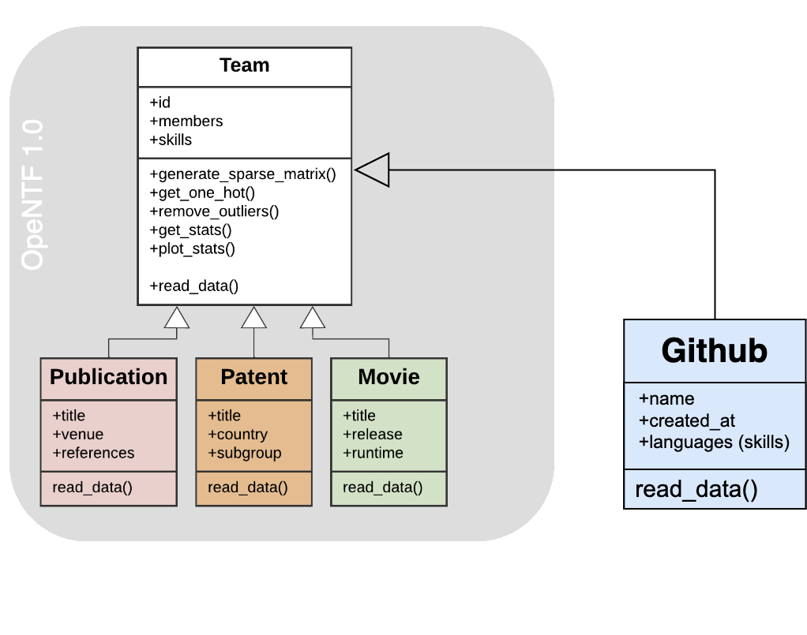
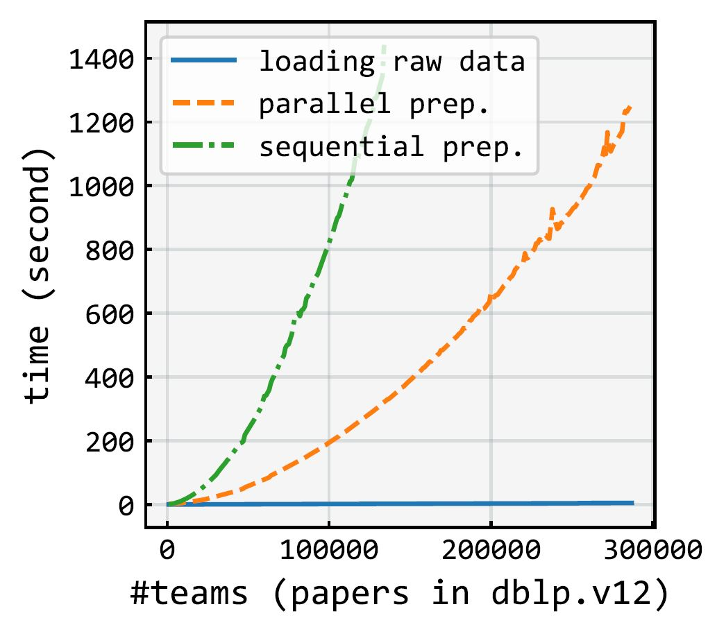
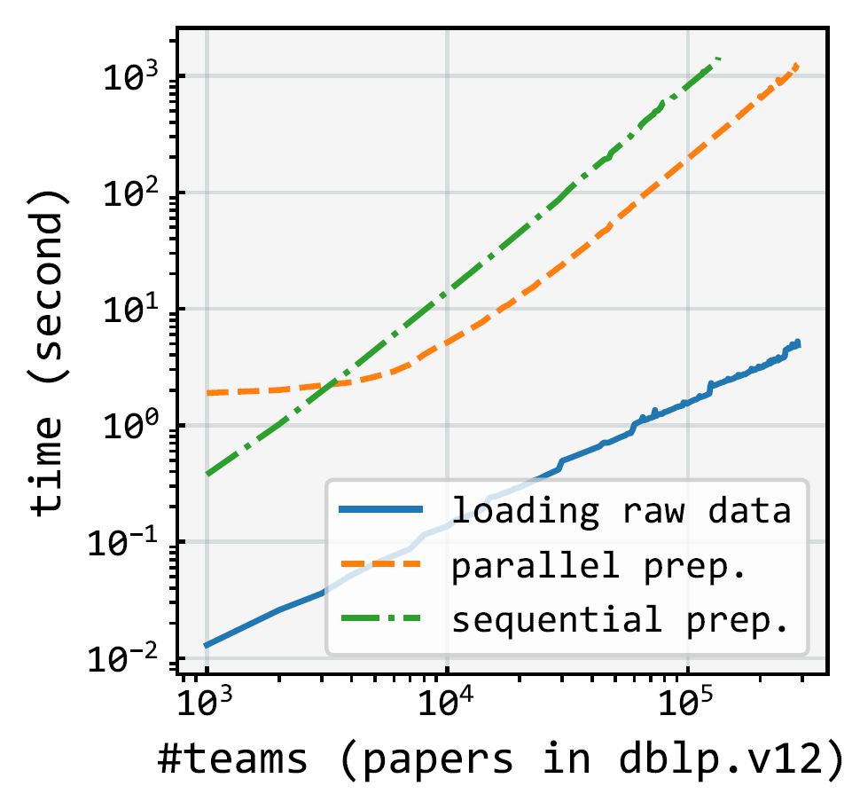

# ``GNN Transferred OpeNTF``: An Open-Source Neural Team Formation Benchmark Library Enhanced by Transfer Learning with Graph Neural Networks 
Formation of a competent team with skillful experts to achieve success in a project is a crucial task.
The Neural team recommenders by researchers have shown unprecedented success over tediously computational methods
in the past. With the recent progress in this line of research, the neural team recommenders now employ 
transferred graph representation learning to surpass any previous methods in forming expert teams 
that are almost surely successful in completing the specific task in question. 
These models treat the problem as an expert recommendation task, where the required skills' dense 
vector representations are derived from a graph neural network applied to a collaboration graph. 
However, there has not been a systematic comparative study on the effects of 
(1) the structure of the collaboration graph, 
(2) the node representation learning technique, and 
(3) the architecture of the final neural recommender on the effectiveness of the recommended teams.

We previously released OpeNTF, an open-source framework hosting canonical neural models as the cutting-edge 
class of approaches, along with large-scale training datasets from varying domains. 
In this paper, we augment the neural benchmark with transfer learning from GNN methods. This encompasses 
two types of heterogeneous collaboration graphs representing skill-expert and skill-team-expert connections and 
seven graph representation learning techniques (GNN and Random Walk based) to obtain dense vector representations of skills for 
both variational and non-variational neural recommenders.


<table border=0>
<tr>
<td >

  
- [1. Setup](#1-setup)
- [2. Quickstart](#2-quickstart)
- [3. Features](#3-features)
  * [`Transfer Learning with GNN`](#31-gnn-transfer-learning)
  * [`Datasets and Parallel Preprocessing`](#32-datasets-and-parallel-preprocessing)
  * [`Neural Team Formation`](#33-non-temporal-neural-team-formation)
  * [`Model Architecture`](#35-model-architecture)
  * [`Negative Sampling Strategies`](#36-negative-sampling-strategies)
  * [`Run`](#37-run)
- [4. Results](#4-results)
- [5. Acknowledgement](#5-acknowledgement)


</td>
<td></td>
<!-- <td></td> -->
</tr>
</table>


## 1. [Setup](https://colab.research.google.com/github/fani-lab/OpeNTF/blob/main/quickstart.ipynb)
You need to have ``Python >= 3.8`` and install the required packages listed in [``requirements.txt``](requirements.txt):

Using git, clone the codebase and using ``pip`` install the required packages:
```sh
git clone --recursive https://github.com/Fani-Lab/opentf
cd opentf
pip install -r requirements.txt
```

For installation of specific version of a python package due to, e.g., ``CUDA`` versions compatibility, one can edit [``requirements.txt``](requirements.txt) and install them manually.
For example - We used CUDA dependant pytorch and pytorch-geometric with the below set of installations : 

```
# CUDA 12.1 for Torch and PyG
pip3 install torch torchvision torchaudio --index-url https://download.pytorch.org/whl/cu121 


```
## 2. Quickstart [](https://colab.research.google.com/github/fani-lab/Adila/blob/main/quickstart.ipynb)

```sh
cd src
python -u main.py -data ../data/raw/dblp/toy.dblp.v12.json -domain dblp -model fnn bnn -fairness det_greedy -attribute popularity
```

The above run, loads and preprocesses a tiny-size toy example dataset [``toy.dblp.v12.json``](data/raw/dblp/toy.dblp.v12.json) from [``dblp``](https://originalstatic.aminer.cn/misc/dblp.v12.7z) followed by _n_-fold train-evaluation on a training split and final test on the test set for ``feedforward`` and ``Bayesian`` neural models using default hyperparameters from [``./src/param.py``](./src/param.py). Then, the predictions will be passed through the `det_greedy` reranking fairness algorithm to mitigate popularity bias in teams with default `k_max`, `np_ratio` fromn [``./src/param.py``](./src/param.py).

```
python -u main.py -data ../data/raw/dblp/toy.dblp.v12.json -domain dblp -model tbnn tbnn_dt2v_emb
```

This script loads and preprocesses the same dataset [``toy.dblp.v12.json``](data/raw/dblp/toy.dblp.v12.json) from [``dblp``](https://originalstatic.aminer.cn/misc/dblp.v12.7z), takes the teams from the the last year as the test set and trains the ``Bayesian`` neural model following our proposed streaming training strategy as explained in ``3.2.2. Temporal Neural Team Formation`` with two different input representations _i_) sparse vector represntation and _ii_) temporal skill vector represntation using default hyperparameters from [``./src/param.py``](./src/param.py).

## 3. Features
#### **3.1. Transfer Learning with GNN**

While state-of-the-art neural team formation methods are able to efficiently analyze massive collections of experts to form effective collaborative teams, they largely ignore the fairness in recommended teams of experts. In `Adila`, we study the application of `fairness-aware` team formation algorithms to mitigate the potential popularity bias in the neural team formation models. We support two fairness notions namely, `equality of opportunity` and `demographic parity`. To achieve fairness, we utilize three deterministic greedy reranking algorithms (`det_greedy`, `det_cons`, `det_relaxed`) in addition to `fa*ir`, a probabilistic greedy reranking algorithm . 


<p align="center"></p>


#### **3.2. Datasets and Parallel Preprocessing**

Raw dataset, e.g., scholarly papers from AMiner's citation network dataset of [``dblp``](https://originalstatic.aminer.cn/misc/dblp.v12.7z), movies from [``imdb``](https://datasets.imdbws.com/), or US patents from [``uspt``](https://patentsview.org/download/data-download-tables) were assumed to be populated in [``data/raw``](data/raw). For the sake of integration test, tiny-size toy example datasets [``toy.dblp.v12.json``](data/raw/dblp/toy.dblp.v12.json) from [``dblp``](https://originalstatic.aminer.cn/misc/dblp.v12.7z), [[``toy.title.basics.tsv``](data/raw/imdb/toy.title.basics.tsv), [``toy.title.principals.tsv``](data/raw/imdb/toy.title.principals.tsv), [``toy.name.basics.tsv``](data/raw/imdb/toy.name.basics.tsv)] from [``imdb``](https://datasets.imdbws.com/) and [``toy.patent.tsv``](data/preprocessed/uspt/toy.patent.tsv) have been already provided.

<p align="center"></p>

Raw data will be preprocessed into two main ``sparse`` matrices each row of which represents: 

>i) ``vecs['member']``: occurrence (boolean) vector representation for members of a team, e.g., authors of a paper or crew members of a movie,
> 
>ii) ``vecs['skill']``: occurrence (boolean) vector representation for required skills for a team, e.g., keywords of a paper or genre of a movie.

Also, indexes will be created to map the vector's indexes to members' names and skills' names, i.e., ``i2c``, ``c2i``, ``i2s``, ``s2i``.

The sparse matrices and the indices will be persisted in [``data/preprocessed/{dblp,imdb,uspt}/{name of dataset}``](data/preprocessed/) as pickles ``teamsvecs.pkl`` and ``indexes.pkl``. For example, the preprocessed data for our dblp toy example are [``data/preprocessed/dblp/toy.dblp.v12.json/teamsvecs.pkl``](data/preprocessed/dblp/toy.dblp.v12.json/teams.pkl) and [``data/preprocessed/dblp/toy.dblp.v12.json/indexes.pkl``](data/preprocessed/dblp/toy.dblp.v12.json/indexes.pkl).

> Our pipeline benefits from parallel generation of sparse matrices for teams that significantly reduces the preprocessing time as shown below:
> 
> <p align="center"></p>


Please note that the preprocessing step will be executed once. Subsequent runs load the persisted pickle files. In order to regenerate them, one should simply delete them. 


#### **3.3. Neural Team Formation**

We randomly take ``85%`` of the dataset for the train-validation set and ``15%`` as the test set, i.e., the model never sees these instances during training or model tuning. You can change ``train_test_split`` parameter in [``./src/param.py``](./src/param.py).


#### **3.5. Model Architecture**

Each model has been defined in [``./src/mdl/``](./src/mdl/) under an inheritance hierarchy. They override abstract functions for ``train``, ``test``, ``eval``, and ``plot`` steps.

For example, for our feedforward baseline [``fnn``](./src/mdl/fnn.py), the model has been implemented in [``./src/mdl/fnn.py``](src/mdl/fnn.py). Model's hyperparameters such as the learning rate (``lr``) or the number of epochs (``e``) can be set in [``./src/param.py``](src/param.py).


<p align="center"></p>
  
Currently, we support neural models:
1) Bayesian [``bnn``](./src/mdl/bnn.py) where model's parameter (weights) is assumed to be drawn from Gaussian (Normal) distribution and the task is to not to learn the weight but the mean (μ) and standard deviation (σ) of the distribution at each parameter.

<p align="center"></p>

2) non-Bayesian feedforward [``fnn``](./src/mdl/fnn.py) where the model's parameter (weights) is to be learnt.

The input to the models is the vector representations for (_temporal_) skills and the output is the vector representation for members. In another word, given the input skills, the models predict the members from the pool of candidates. We support three vector representations:

i) Sparse vector representation (occurrence or boolean vector): See preprocessing section above.

ii) Dense vector representation ([``team2vec``](src/mdl/team2vec/main.py)) channeling into several sets of embedding generation methods as follows:  

  A) Doc2Vec: Inspired by paragraph vectors by [Le and Mikolov](https://cs.stanford.edu/~quocle/paragraph_vector.pdf), we consider a team as a document and skills as the document words (``embtype == 'skill'``). Using distributed memory model, we map skills into a real-valued embedding space. Our embedding method benefits from [``gensim``](https://radimrehurek.com/gensim/) library.

  B) Graph-based: This class of representation is divided into Random-walk-based and Message-passing-based embedding generation methods. 
  For meta-path-based methods (Metapath2Vec), Each meta-path-based random walk is considered as a document whose words are the nodes followed by [word2vec](https://arxiv.org/abs/1301.3781) to 
  produce 𝑑-dimensional vector representations for the skill nodes.

  For message-passing-based methods i.e. Graph Neural Network methods (GraphSAGE, Graph Attention Network etc.), we use message passing to
  learn a node vector (``node_type == skill``) based on a recursive aggregation (``agg``) and a combination (``comb``) of direct (1-hop) or indirect (𝑘-hop) neighbouring nodes’
  vectors via neural message passing. 

#### **3.6. Negative Sampling Strategies**

As known, employing ``unsuccessful`` teams convey complementary negative signals to the model to alleviate the long-tail problem. Most real-world training datasets in the team formation domain, however, do not have explicit unsuccessful teams (e.g., collections of rejected papers.) In the absence of unsuccessful training instances, we proposed negative sampling strategies based on the ``closed-world`` assumption where no currently known successful group of experts for the required skills is assumed to be unsuccessful.  We study the effect of ``three`` different negative sampling strategies: two based on static distributions, and one based on adaptive noise distribution:

1) Uniform distribution (``uniform``), where subsets of experts are randomly chosen with the ``same probability`` as unsuccessful teams from the uniform distribution over all subsets of experts.

2) Unigram distribution (``unigram``), where subsets of experts are chosen regarding ``their frequency`` in all previous successful teams. Intuitively, teams of experts that have been more successful but for other skill subsets will be given a higher probability and chosen more frequently as a negative sample to dampen the effect of popularity bias.

3) Smoothed unigram distribution in each training minibatch (``unigram_b``), where we employed the ``add-1 or Laplace smoothing`` when computing the unigram distribution of the experts but in each training minibatch. Minibatch stochastic gradient descent is the _de facto_ method for neural models where the data is split into batches of data, each of which is sent to the model for the partial calculation to speed up training while maintaining high accuracy. 

To include a negative sampling strategy, there are two parameters for a model to set in [``./src/param.py``](src/param.py):
- ``ns``: the negative sampling strategy which can be ``uniform``, ``unigram``, ``unigram_b`` or ``None``(no negative sampling).
- ``nns``: number of negative samples

#### **3.7. Run**

The entire codebase has two distinct pipelines:

1. ``./src/mdl/team2vec/main.py`` handling the embedding generation step in case of dense vector input for the neural team formation
2. ``./src/main.py`` handling the main pipeline of the neural team formation

The embedding generation pipeline consists of the models``d2v (Doc2Vec), m2v (Metapath2Vec), gs (GraphSAGE), gat (GraphAttention), gatv2 (GraphAttentionV2),
han (Heterogeneous Attention Network), gin (Graph Isomorphism Network) and gine (GIN-Edge feature enhanced).``
This pipeline accepts the following required arguments:
1) ``-teamsvecs``: The path to the teamsvecs.pkl and indexes.pkl files; e.g., ``-teamsvecs ../data/preprocessed/dblp/toy.dblp.v12.json/``
2) ``-model``: The embedding model; e.g., ``-model d2v, m2v, gs ...``

To generate GNN based embeddings, it is recommended to include additional arguments as follows:  

1) ``--agg``: The aggregation method used for the graph data; e.g : ``mean, none, max, min ...``
2) ``--d``: Embedding dimension; e.g : ``4, 8, 16, 32 ...``
3) ``--e``: Train epochs ; e.g : ``5, 20, 100 ...``

The neural network pipeline accepts three required list of values:
1) ``-data``: list of path to the raw datafiles, e.g., ``-data ./../data/raw/dblp/dblp.v12.json``, or the main file of a dataset, e.g., ``-data ./../data/raw/imdb/title.basics.tsv``
2) ``-domain``: list of domains of the raw data files that could be ``dblp``, ``imdb``, or `uspt`; e.g., ``-domain dblp imdb``.
3) ``-model``: list of baseline models that could be ``fnn``, ``bnn``; e.g., ``-model fnn bnn``.

If the input type is a dense vector from GNN methods, an additional list of arguments are needed as follows:
1) ``--emb_model``: The embedding model; e.g., ``--emb_model gs gat gatv2 han ...``
2)  ``--emb_graph_type`` The collaboration graph type used for embedding generation e.g., ``sm or stm``


Here is a brief explanation of the models:
- ``fnn``, ``bnn``, ``fnn_emb``, ``bnn_emb``: follows the standard machine learning training procedure.

## 4. Results

We used [``pytrec_eval_terrier``](https://pypi.org/project/pytrec-eval-terrier/) to evaluate the performance of models on the test set as well as on their own train sets (should overfit) and validation sets. Our model reports the predictions, evaluation metrics on each test instance, and average on all test instances in the format ``./output/{dataset name}/{model name}/{model's running setting}/``.  For example:

1) ``f0.test.pred`` is the predictions per test instance for a model which is trained folds [1,2,3,4] and validated on fold [0].
2) ``f0.test.pred.eval.csv`` is the values of evaluation metrics for the predictions per test instance
3) ``f0.test.pred.eval.mean.csv`` is the average of values for evaluation metrics over all test instances.
4) ``test.pred.eval.mean.csv`` is the average of values for evaluation metrics over all _n_ fold models.

For ease of summarization, we put the entire set of average results (over all folds) across all methods and all dimensions in xlsx files mentioned in the next table.

**Benchmarks at Scale**

**Neural Team Formation w/o Transfer Learning**

|              | min. #member's team: 120 (dblp) and 75 (imdb), min team size: 3, epochs: 25, learning rate: 0.0001 (fnn), 0.01 (bnn), hidden layer: [1, 128d], minibatch: 2048, #negative samples: 3           |
|--------------|------------------------------------------------------------------------------------------------------------------------------------------------------------------------------------------------|
| Datasets     | [dblp.v12](https://originalstatic.aminer.cn/misc/dblp.v12.7z), [imdb](https://imdb.com/interfaces/)                                                                                            |
| Metrics      | recall@2,5,10, map@2,5,10, ndcg@2,5,10, p@2,5,10, auc                                                                                                                                          |
| Baselines    | {fnn,bnn}×{sparse,{emb}×{d2v,m2v,gs,gat,gatv2,han,gin,gine}}×{uniform}                                                                                                                         |
| Full Results | [``./output/dblp.v12.json.filtered.mt120.ts3/``](./output/dblp.v12.json.filtered.mt120.ts3/), [``./output/title.basics.tsv.filtered.mt75.ts3/``](./output/title.basics.tsv.filtered.mt75.ts3/) |

<p align="center">


## 5. Acknowledgement:
We benefit from  bayesian-torch (https://github.com/IntelLabs/bayesian-torch), PyG (https://github.com/pyg-team/pytorch_geometric), [``pytrec_eval``](https://github.com/cvangysel/pytrec_eval), [``gensim``](https://radimrehurek.com/gensim/), [Josh Feldman's blog](https://joshfeldman.net/WeightUncertainty/) and other libraries. We would like to thank the authors of these libraries and helpful resources.
  
[//]: # (## 6. License:)

[//]: # (©2024. This work is licensed under a [CC BY-NC-SA 4.0]&#40;license.txt&#41; license.)
