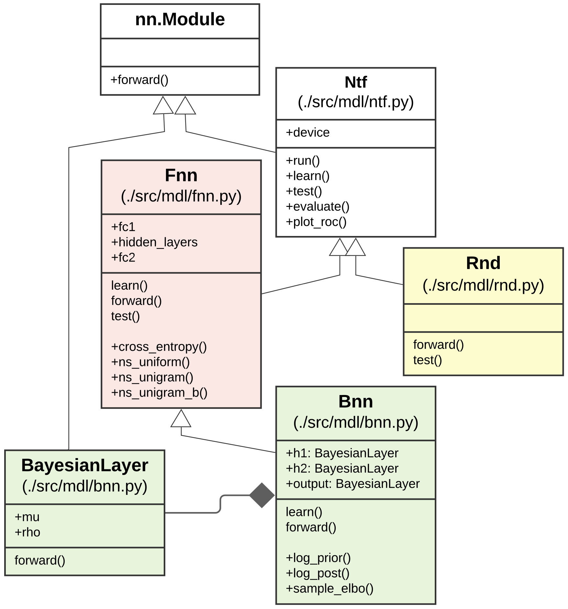
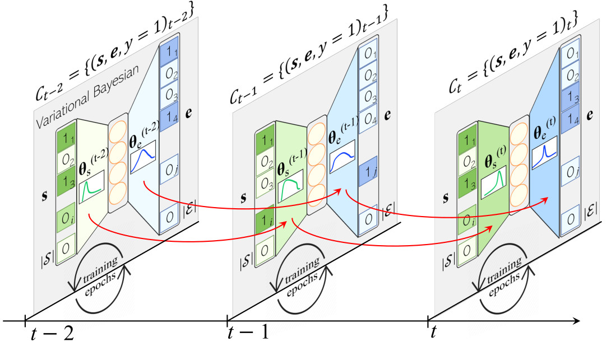
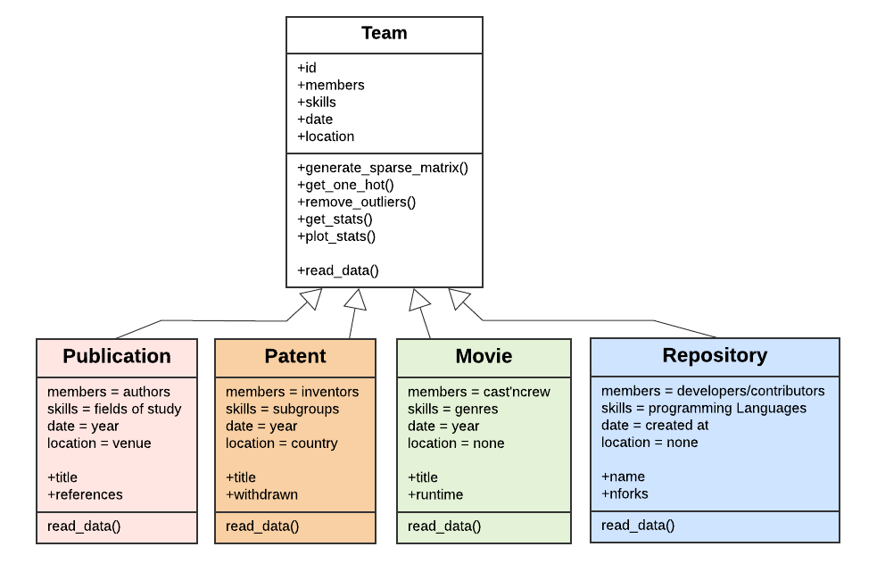

# ``OpeNTF``: An Open-Source Neural Team Formation Benchmark Library 
 [](https://creativecommons.org/licenses/by-nc-sa/4.0/) [](https://github.com/fani-lab/OpeNTF/actions)

<sub>
 
> 2026, COIN, A Probabilistic Greedy Attempt to be Fair in Neural Team Recommendation. `Under Review: Revision Requested` [`pdf`](https://hosseinfani.github.io/res/papers/2026_COIN_A_Probabilistic_Greedy_Attempt_to_be_Fair_in_Neural_Team_Recommendation.pdf) [`reviews`](https://hosseinfani.github.io/res/papers/2026_COIN_A_Probabilistic_Greedy_Attempt_to_be_Fair_in_Neural_Team_Recommendation_R1.pdf)

> 2023, BIAS-ECIR, Bootless Application of Greedy Re-ranking Algorithms in Fair Neural Team Formation.[`pdf`](https://hosseinfani.github.io/res/papers/2023_BIAS_ECIR_Bootless_Application_of_Greedy_Re-ranking_Algorithms_in_Fair_Neural_Team_Formation.pdf) [`doi`](https://doi.org/10.1007/978-3-031-37249-0_9) [`reviews`](https://hosseinfani.github.io/res/papers/2023_BIAS_ECIR_Bootless_Application_of_Greedy_Re-ranking_Algorithms_in_Fair_Neural_Team_Formation.txt) [`video`](https://www.youtube.com/watch?v=EmAFvANqzBM)

 ---
 
> 2026, XXXX, Graph Neural Team Recommendation: An Integrated Approach. `Under Review` [`pdf`](https://hosseinfani.github.io/res/papers/Graph_Neural_Team_Recommendation_An_Integrated_Approach.pdf) 
 
> 2025, SIGIR, Translative Neural Team Recommendation. [`pdf`](https://hosseinfani.github.io/res/papers/2025_SIGIR_Translative_Neural_Team_Recommendation_From_Multilabel_Classification_to_Sequence_Prediction.pdf) [`doi`](https://doi.org/10.1145/3726302.3730259) [`reviews`](https://hosseinfani.github.io/res/papers/2025_SIGIR_Translative_Neural_Team_Recommendation_From_Multilabel_Classification_to_Sequence_Prediction.txt) [`poster`](https://hosseinfani.github.io/res/posters/2025_SIGIR_Translative_Neural_Team_Recommendation_From_Multilabel_Classification_to_Sequence_Prediction.pdf)

> 2025, WSDM, Adaptive Loss-based Curricula for Neural Team Recommendation. [`pdf`](https://hosseinfani.github.io/res/papers/2025_WSDM_Adaptive_Loss-based_Curricula_for_Neural_Team_Recommendation.pdf) [`doi`](https://doi.org/10.1145/3701551.3703574) [`reviews`](https://hosseinfani.github.io/res/papers/2025_WSDM_Adaptive_Loss-based_Curricula_for_Neural_Team_Recommendation.txt)

> 2024, ECIR, A Streaming Approach to Neural Team Formation Training. [`pdf`](https://hosseinfani.github.io/res/papers/2024_ECIR_A_Streaming_Approach_to_Neural_Team_Formation_Training.pdf) [`doi`](https://doi.org/10.1007/978-3-031-56027-9_20) [`reviews`](https://hosseinfani.github.io/res/papers/2024_ECIR_A_Streaming_Approach_to_Neural_Team_Formation_Training.txt) [`ppt`](https://hosseinfani.github.io/res/slides/2024_ECIR_A_Streaming_Approach_to_Neural_Team_Formation_Training.pdf) [`video`](https://www.youtube.com/watch?v=tPP68i4ILFs)

> 2024, WISE, Skill Vector Representation Learning for Collaborative Team Recommendation: A Comparative Study. [`pdf`](https://hosseinfani.github.io/res/papers/2024_WISE_Skill_Vector_Representation_Learning_for_Collaborative_Team_Recommendation__A_Comparative_Study.pdf) [`doi`](https://doi.org/10.1007/978-981-96-0567-5_15) [`reviews`](https://hosseinfani.github.io/res/papers/2024_WISE_Skill_Vector_Representation_Learning_for_Collaborative_Team_Recommendation__A_Comparative_Study.txt)

> 2022, CIKM, Effective Neural Team Formation via Negative Samples. [`pdf`](https://hosseinfani.github.io/res/papers/2022_CIKM_Effective_Neural_Team_Formation_via_Negative_Samples.pdf) [`doi`](https://dl.acm.org/doi/10.1145/3511808.3557590) [`reviews`](https://hosseinfani.github.io/res/papers/2022_CIKM_Effective_Neural_Team_Formation_via_Negative_Samples.txt)

> 2022, CIKM, OpeNTF: A Benchmark Library for Neural Team Formation. [`pdf`](https://hosseinfani.github.io/res/papers/2022_CIKM_OpeNTF_A_Benchmark_Library_for_Neural_Team_Formation.pdf) [`doi`](https://dl.acm.org/doi/10.1145/3511808.3557526) [`reviews`](https://hosseinfani.github.io/res/papers/2022_CIKM_OpeNTF_A_Benchmark_Library_for_Neural_Team_Formation.txt) [`video`](https://www.youtube.com/playlist?list=PLKFWrqRN8VmQBEyNBn8kXhaYpG6Gpecko)

---

> 2026, WWW, Learning Collaborative Teams via Social Information Retrieval. [`pdf`](https://hosseinfani.github.io/res/papers/2026_Learning_Collaborative_Teams_via_Social_Information_Retrieval.pdf) [`web`](https://fani-lab.github.io/OpeNTF/tutorial/www26/)

> 2025, CIKM, Neural Shifts in Collaborative Team Recommendation. [`pdf`](https://hosseinfani.github.io/res/papers/2025_CIKM_Neural_Shifts_in_Collaborative_Team_Recommendation.pdf) [`web`](https://fani-lab.github.io/OpeNTF/tutorial/cikm25/)

> 2025, WSDM, Bridging Subgraph Optimization and Graph Neural Network in Team Recommendations. [`pdf`](https://hosseinfani.github.io/res/papers/2025_WSDM_Bridging_Historical_Subgraph_Optimization_and_Modern_Graph_Neural_Network_Approaches_in_Team_Recommendations.pdf) [`web`](https://fani-lab.github.io/OpeNTF/tutorial/wsdm25/) [`doi`](https://dl.acm.org/doi/10.1145/3701551.3703483) [`ppt`](https://hosseinfani.github.io/res/slides/2025_WSDM_Bridging_Historical_Subgraph_Optimization_and_Modern_Graph_Neural_Network_Approaches_in_Team_Recommendations.pdf)

> 2024, SIGIR-AP, Paradigm Shifts in Team Recommendation: From Subgraph Optimization to Graph Neural Network. [`pdf`](https://hosseinfani.github.io/res/papers/2024_SIGIRAP_Paradigm_Shifts_in_Team_Recommendation_From_Historical_Subgraph_Optimization_to_Emerging_Graph_Neural_Network.pdf) [`web`](https://fani-lab.github.io/OpeNTF/tutorial/sigir-ap24/) [`doi`](https://doi.org/10.1145/3673791.3698440) [`ppt`](https://hosseinfani.github.io/res/slides/2024_SIGIRAP_Paradigm_Shifts_in_Team_Recommendation_From_Historical_Subgraph_Optimization_to_Emerging_Graph_Neural_Network.pdf) [`video`](https://www.youtube.com/playlist?list=PLKFWrqRN8VmSOQA74QRJRwwYDyp1YNZE-)

> 2024, UMAP, Collaborative Team Recommendation for Skilled Users: Objectives, Techniques, and Perspectives. [`pdf`](https://hosseinfani.github.io/res/papers/2024_UMAP_Collaborative_Team_Recommendation_for_Skilled_Users_Objectives_Techniques_and_New_Perspectives.pdf) [`web`](https://fani-lab.github.io/OpeNTF/tutorial/umap24/) [`doi`](https://dl.acm.org/doi/10.1145/3631700.3658521) [`ppt`](https://www.slideshare.net/slideshow/collaborative-team-recommendation-for-skilled-users-objectives-techniques-and-new-perspectives/270130704) [`video`](https://www.youtube.com/playlist?list=PLKFWrqRN8VmRmxwDKlaA7Moa_Wv0li7ex)
---
</sub>

Team formation (recommendation) involves selecting a team of skillful experts who will, more likely than not, accomplish a task. Researchers have proposed a rich body of computational methods to automate the traditionally tedious and error-prone manual process. We release `OpeNTF`, an open-source neural team formation framework hosting canonical `neural models` as the cutting-edge class of approaches, along with `large-scale` training datasets from `varying domains`. It further includes `temporal` training strategy for neural models’ training to capture the evolution of experts’ skills and collaboration ties over `time`, as opposed to randomly shuffled training datasets. OpeNTF also integrates `debiasing reranking` algorithms at its last step to mitigate the `popularity` and `gender` disparities in the neural models’ team recommendations based on two alternative notions of fairness: `equal opportunity` and `demographic parity`. OpeNTF is a forward-looking effort to automate team formation via fairness-aware and time-sensitive methods. AI-ML-based solutions are increasingly impacting how resources are allocated to various groups in society, and ensuring fairness and time are systematically considered is key.

<table border=0>
<tr>
<td >

- [1. Setup](#1-setup)
- [2. Quickstart](#2-quickstart)
- [3. Features](#3-features)
  * [`Neural Models`](#31-neural-models)
  * [`Fairness-aware Team Formation`](#32-adila-fairness-aware-team-formation)
  * [`Temporal Team Prediction`](#33-temporal-team-prediction)
  * [`Negative Sampling Strategies`](#34-negative-sampling-strategies)
  * [`Datasets and Parallel Preprocessing`](#35-datasets-and-parallel-preprocessing)
- [4. Results](#4-results)
- [5. Acknowledgement](#5-acknowledgement)
- [6. License](#6-license)
- [7. Awards](#7-awards)


</td>
<td></td>
<!-- <td></td> -->
</tr>
</table>


## 1. [Setup](https://colab.research.google.com/github/fani-lab/OpeNTF/blob/main/ipynb/quickstart.ipynb)
`OpeNTF` needs `Python >= 3.8` and installs required packages lazily and on-demand, i.e., as it goes through the steps of the pipeline, it installs a package if the package or the correct version is not available in the environment. For further details, refer to [``requirements.txt``](requirements.txt) and [``pkgmgr.py``](./src/pkgmgr.py). To set up an environment locally:

```sh
#python3.8
python -m venv opentf_venv
source opentf_venv/bin/activate #non-windows
#opentf_venv\Scripts\activate #windows
pip install --upgrade pip
pip install -r requirements.txt
```

For installation of a specific version of a python package due to, e.g., ``CUDA`` versions compatibility, edit [``requirements.txt``](requirements.txt) like:

```
#$ torch==2.4.1 --index-url https://download.pytorch.org/whl/cu118
```

To run in a `container`, a docker `image` can be built and run by customizing the [`Dockerfile`](Dockerfile).

## 2. Quickstart 

```sh
cd src
python main.py "cmd=[prep, train, test, eval]" \
               "models.instances=[mdl.rnd.Rnd, mdl.fnn.Fnn, mdl.bnn.Bnn]" \
               data.domain=cmn.publication.Publication data.source=../data/dblp/toy.dblp.v12.json data.output=../output/dblp/toy.dblp.v12.json \
               ~data.filter \
               train.train_test_ratio=0.85 train.nfolds=3 train.save_per_epoch=3 \
               test.per_epoch=True test.topK=100 \
               eval.topk=\'2,5,10\'
```

The above run, loads and preprocesses a tiny-size toy example dataset [``toy.dblp.v12.json``](data/dblp/toy.dblp.v12.json) from [``dblp``](https://originalstatic.aminer.cn/misc/dblp.v12.7z) with `no` filtering followed by `3`-fold cross train-validation on a training split and a final test on the test set for `feedforward` and `Bayesian` neural models as well as a `random` model using default hyperparameters from [`./src/mdl/__config__.yaml`](./src/mdl/__config.yaml). For a step-by-step guide and output trace, see our colab script [](https://colab.research.google.com/github/fani-lab/OpeNTF/blob/main/ipynb/quickstart.ipynb).


## 3. Features

#### **3.1. Neural Models**

<p align="center"></p>

Each model has been defined in [``./src/mdl/``](./src/mdl/) under an inheritance hierarchy. They override abstract functions for ``train``, ``test``, ``eval``, and ``plot`` steps. For example, for our feedforward baseline [``fnn``](./src/mdl/fnn.py), the model has been implemented in [``./src/mdl/fnn.py``](src/mdl/fnn.py). Model's hyperparameters such as the learning rate (``lr``) or the number of epochs (``e``) can be set in [``./src/mdl/__config__yaml``](./src/mdl/__config__yaml), or overriden in running command as shown in the [``quickstart``](https://colab.research.google.com/github/fani-lab/OpeNTF/blob/main/ipynb/quickstart.ipynb) script.
  
Currently, from [``./src/mdl/``](./src/mdl/), we support 

> Neural mutlilabel classifiers including non-Bayesian feedforward [``fnn``](./src/mdl/fnn.py) and Bayesian [``bnn``](./src/mdl/bnn.py), where each expert candidate is a label and team recommendation is a multilabel classification;
>
> See [A Variational Neural Architecture for Skill-based Team Formation, TOIS23](https://dl.acm.org/doi/abs/10.1145/3589762) for details and results.

> Seq-to-seq and transformer-based models via [``nmt``](./src/mdl/nmt.py) wrapper over [`OpenNMT`](https://github.com/OpenNMT/OpenNMT-py), where the required subset of skills is mapped to the optimum subset of experts;
>
> See [Translative Neural Team Recommendation, SIGIR25](https://doi.org/10.1145/3726302.3730259) for details and results.
 
> Gnn-based models via [``gnn``](./src/mdl/gnn.py) using [`PyG`](https://pyg.org/), where the optimum subset of experts is predicted via link prediction between expert and team nodes in an expert graph, as shown in our colab script [](https://colab.research.google.com/github/fani-lab/OpeNTF/blob/main/ipynb/gnn.ipynb). 

From [``./src/mdl/emb/``](./src/mdl/emb/), we also support dense vector representation learning methods for skills to be fed into the neural mutlilabel classifiers:

> [``d2v``](src/mdl/emb/d2v.py): Inspired by paragraph vectors by [Le and Mikolov](https://dl.acm.org/doi/10.5555/3044805.3045025), we consider a team as a document and skills as the document words and embed skills using [``gensim``](https://radimrehurek.com/gensim/).

> [`gnn`](src/mdl/emb/gnn.py): A graph neural network can be used to embed skills in an expert graph (transfer-based). Via [`PyG`](https://pyg.org/), we implemented random-walk-based methods like `node2vec` and `metapath2vec`, or message-passing-based like 'graphsage', and many more. See [](https://colab.research.google.com/github/fani-lab/OpeNTF/blob/main/ipynb/gnn.ipynb).
>
> See [Skill Vector Representation Learning for Collaborative Team Recommendation: A Comparative Study, WISE24](https://doi.org/10.1007/978-981-96-0567-5_15) for details and results.

#### **3.2. [`Adila`](https://github.com/fani-lab/Adila): Fairness-aware Team Formation**

<p align="center"></p>

Neural team formation methods largely ignore the fairness in the recommended teams of experts. We study the application of fairness-aware re-ranking algorithms to mitigate the potential `popularity` or `gender` biases in [`Adila`](https://github.com/fani-lab/Adila) and integrate it as submodule in `OpeNTF`. We support fairness notions `equal opportunity` and `demographic parity`. To achieve fairness, we utilize post-hoc reranking algorithms (`det_greedy`, `det_cons`, `det_relaxed`, `fa*ir`). Fairness criteria can be set in [`./src/__config__.yaml#L95`](https://github.com/fani-lab/OpeNTF/blob/main/src/__config__.yaml#L95). For sample run, see [](https://colab.research.google.com/github/fani-lab/OpeNTF/blob/main/ipynb/fair.ipynb).

> See [Bootless Application of Greedy Re-ranking Algorithms in Fair Neural Team Formation. BIAS-ECIR23](https://doi.org/10.1007/978-3-031-37249-0_9) for details and results.

#### **3.3. Temporal Team Prediction**

<p align="center"></p>

Team formation models generally assume that teams follow the i.i.d property and follow the bag of teams approach during training (a shuffled dataset of teams). With temporal training, we aim to predict `future` teams of experts. We sort the teams by time intervals and train a neural model incrementally through the ordered collection of teams, as seen below. To run models under temporal training strategy, set [`models.instances`](https://github.com/fani-lab/OpeNTF/blob/main/src/__config__.yaml#L57) to `[mdl.tntf.tNtf_mdl.fnn.Fnn]`, `[mdl.tntf.tNtf_mdl.bnn.Bnn]`, or both `[mdl.tntf.tNtf_mdl.fnn.Fnn, mdl.tntf.tNtf_mdl.bnn.Bnn]` in [`src/__config__.yaml`](https://github.com/fani-lab/OpeNTF/blob/main/src/__config__.yaml).

See [A Streaming Approach to Neural Team Formation Training, ECIR24](https://doi.org/10.1007/978-3-031-56027-9_20) for details and results.

#### **3.4. Negative Sampling Strategies**

As is known, using ``unsuccessful`` teams convey complementary negative signals to the model. However, most real-world training datasets in the team formation domain do not have explicit unsuccessful teams (e.g., collections of rejected papers.) In the absence of unsuccessful training instances, we proposed negative sampling strategies based on the ``closed-world`` assumption, where no currently known successful group of experts for the required skills is assumed to be unsuccessful. We study the effect different negative sampling strategies: 

> Uniform distribution (``uniform``), where subsets of experts are randomly chosen with the ``same probability`` as unsuccessful teams from the uniform distribution over all subsets of experts.

> Unigram distribution (``unigram``), where subsets of experts are chosen regarding ``their frequency`` in all previous successful teams. Intuitively, teams of experts that have been more successful but for other skill subsets will be given a higher probability and chosen more frequently as a negative sample to dampen the effect of popularity bias.

> Smoothed unigram distribution in each training minibatch (``unigram_b``), where we employed the ``add-1 or Laplace smoothing`` when computing the unigram distribution of the experts but in each training minibatch.

To include a negative sampling strategy, set [`nsd`](https://github.com/fani-lab/OpeNTF/blob/main/src/mdl/__config__.yaml#L3) and the number of negative samples to draw [`ns`](https://github.com/fani-lab/OpeNTF/blob/main/src/mdl/__config__.yaml#L4) in [`src/mdl/__config__.yaml`](https://github.com/fani-lab/OpeNTF/blob/main/src/mdl/__config__.yaml)

See [Effective Neural Team Formation via Negative Samples, CIKM22](https://dl.acm.org/doi/10.1145/3511808.3557590) for details and results.

#### **3.5. Datasets and Parallel Preprocessing**

Raw dataset, e.g., scholarly papers from AMiner's citation network dataset of [``dblp``](https://originalstatic.aminer.cn/misc/dblp.v12.7z), movies from [``imdb``](https://datasets.imdbws.com/), or US patents from [``uspt``](https://patentsview.org/download/data-download-tables) were assumed to be populated in [``data``](data). For the sake of integration test, tiny-size toy example datasets [``toy.dblp.v12.json``](data/dblp/toy.dblp.v12.json) from [``dblp``](https://originalstatic.aminer.cn/misc/dblp.v12.7z), [[``toy.title.basics.tsv``](data/imdb/toy.title.basics.tsv), [``toy.title.principals.tsv``](data/imdb/toy.title.principals.tsv), [``toy.name.basics.tsv``](data/imdb/toy.name.basics.tsv)] from [``imdb``](https://datasets.imdbws.com/), [``toy.repos.csv``](data/uspt/toy.repos.csv) for `github`, and [``toy.patent.tsv``](data/uspt/toy.patent.tsv) from `US patents` have been already provided.

<p align="center"></p>

Raw data will be preprocessed into two main ``sparse`` matrices each row of which represents: 

>``teamsvecs['member']``: occurrence (boolean) vector representation for members of a team, e.g., authors of a paper or crew members of a movie,
> 
>``teamsvecs['skill']``: occurrence (boolean) vector representation for required skills for a team, e.g., keywords of a paper or genre of a movie.
>
>``teamsvecs['loc']``: occurrence (boolean) vector representation for a team's location, e.g., conference/journal of a paper.

Also, indexes will be created to map the vector's indexes to members', skills', and locations' names, i.e., ``i2c``, ``c2i``, ``i2s``, ``s2i``.

The sparse matrices and the indices will be persisted in [``ouptut/{dblp,imdb,uspt}/{name of dataset}``](output/) as pickles ``teamsvecs.pkl`` and ``indexes.pkl``. For example, the preprocessed data for our dblp toy example are [``output/dblp/toy.dblp.v12.json/teamsvecs.pkl``](output/dblp/toy.dblp.v12.json/teams.pkl) and [``output/dblp/toy.dblp.v12.json/indexes.pkl``](output/dblp/toy.dblp.v12.json/indexes.pkl).

> Our pipeline benefits from parallel generation of sparse matrices for teams, which significantly reduces the preprocessing time as shown below:
> 
> <p align="center"></p>

Please note that the preprocessing step will be executed once. Subsequent runs load the persisted pickle files. In order to re-generate them, one should simply delete them. 

## 4. Results

We used [``pytrec_eval``](https://github.com/cvangysel/pytrec_eval) to evaluate the performance of models on the test set as well as on their own train sets (should overfit) and validation sets. We report the predictions, evaluation metrics on each test instance, and average on all test instances in ``./output/{domain}/{dataset}/{split}/{model}.{setting}/``.  For example, see [`output/dblp/toy.dblp.v12.json/splits.f3.r0.85/gcn.b1000.e100.ns5.lr0.001.es5.spe10.d128.add.stm.h128.nn30-20`](https://github.com/fani-lab/OpeNTF/tree/main/output/dblp/toy.dblp.v12.json/splits.f3.r0.85/gcn.b1000.e100.ns5.lr0.001.es5.spe10.d128.add.stm.h128.nn30-20), where:

> ``f0.test.pred`` is the predictions per test instance for a model which is trained folds [1,2,3,4] and validated on fold [0].
>
> ``f0.test.pred.eval.csv`` is the values of evaluation metrics for the predictions per test instance
>
> ``f0.test.pred.eval.mean.csv`` is the average of values for evaluation metrics over all test instances.
>
> ``test.pred.eval.mean.csv`` is the average of values for evaluation metrics over all _n_ fold models.

## 5. Acknowledgement:
We benefit from [`bayesian-torch`](https://github.com/IntelLabs/bayesian-torch), [`OpenNMT-py`](https://github.com/OpenNMT/OpenNMT-py), [``reranking``](https://github.com/yuanlonghao/reranking) and [`fairsearchcore`](https://github.com/fair-search/fairsearch-fair-python), [``pytrec_eval``](https://github.com/cvangysel/pytrec_eval), and other libraries. We would like to thank the authors of these libraries and helpful resources.
  
## 6. License:
©2025. This work is licensed under a [CC BY-NC-SA 4.0](license.txt) license.

## 7. Awards:

> [CAD$300, Gold medalist, UWill Discover, 2022](https://scholar.uwindsor.ca/uwilldiscover/2022/2022Day3/30/)

> CAD$300, Best Research, Demo Day, School of Computer Science, University of Windsor, 2022. 
