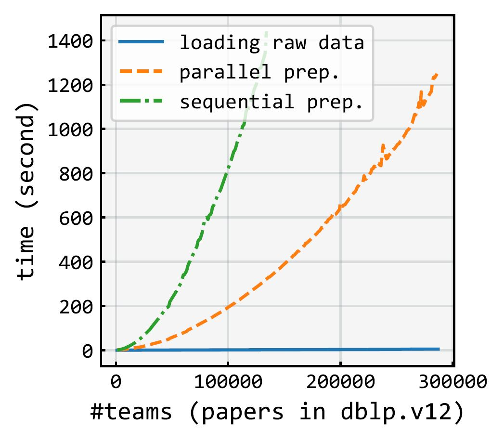

# ``OpeNTF``: An Open-Source Neural Team Formation via Adaptive Loss-based Curricula
Team formation involves selecting a team of skillful experts who will, more likely than not, accomplish a task. Researchers have proposed a rich body of computational methods to automate the traditionally tedious and error-prone manual process. We previously released OpeNTF, an open-source framework hosting canonical neural models as the cutting-edge class of approaches, along with large-scale training datasets from varying domains. In this repo, we extend OpeNTF with `curriculum learning` training strategy for neural models' training to capture the difficulty level of experts to learn easy popular experts first, then moving toward hard nonpopular experts, as opposed to randomly shuffled training datasets. 

<table border=0>
<tr>
<td >

  
- [1. Setup](#1-setup)
- [2. Quickstart](#2-quickstart)
- [3. Features](#3-features)
  * [`Dynamic Loss-based Curriculum Learning`](#31-Dynamic-Loss-based-Curriculum-Learning)
  * [`Datasets and Parallel Preprocessing`](#32-datasets-and-parallel-preprocessing)
  * [`Model Architecture`](#35-model-architecture)
  * [`Run`](#37-run)
- [4. Results](#4-results)
- [5. Acknowledgement](#5-acknowledgement)


## 1. [Setup](https://colab.research.google.com/github/fani-lab/OpeNTF/blob/main/quickstart.ipynb)
You need to have ``Python >= 3.8`` and install the following main packages, among others listed in [``requirements.txt``](requirements.txt):
```
torch>=1.9.0
pytrec-eval-terrier==0.5.2
gensim==3.8.3
```
By ``pip``, clone the codebase and install the required packages:
```sh
git clone --recursive https://github.com/[anonymous]
cd opentf
pip install -r requirements.txt
```
By [``conda``](https://www.anaconda.com/products/individual):

```sh
git clone --recursive https://github.com/[anonymous]
cd opentf
conda env create -f environment.yml
conda activate opentf
```

For installation of specific version of a python package due to, e.g., ``CUDA`` versions compatibility, one can edit [``requirements.txt``](requirements.txt) or [``environment.yml``](environment.yml) like as follows:

```
# CUDA 10.1
torch==1.6.0+cu101 -f https://download.pytorch.org/whl/torch_stable.html
```
## 2. Quickstart [](https://colab.research.google.com/github/fani-lab/Adila/blob/main/quickstart.ipynb)

```sh
cd src
python -u main.py -data ../data/raw/dblp/toy.dblp.v12.json -domain dblp -model fnn bnn -fairness det_greedy -attribute popularity
```

The above run, loads and preprocesses a tiny-size toy example dataset [``toy.dblp.v12.json``](data/raw/dblp/toy.dblp.v12.json) from [``dblp``](https://originalstatic.aminer.cn/misc/dblp.v12.7z) followed by _n_-fold train-evaluation on a training split and final test on the test set for ``feedforward`` and ``Bayesian`` neural models using default hyperparameters from [``./src/param.py``](./src/param.py). Then, the predictions will be passed through the `det_greedy` reranking fairness algorithm to mitigate popularity bias in teams with default `k_max`, `np_ratio` fromn [``./src/param.py``](./src/param.py).

```
python -u main.py -data ../data/raw/dblp/toy.dblp.v12.json -domain dblp -model bnn bnn_emb
```

This script loads and preprocesses the same dataset [``toy.dblp.v12.json``](data/raw/dblp/toy.dblp.v12.json) from [``dblp``](https://originalstatic.aminer.cn/misc/dblp.v12.7z), takes the teams from the the last year as the test set and trains the ``Bayesian`` neural model

## 3. Features

#### **3.1. Dynamic Loss-based Curriculum Learning** 
inspired by the curriculum learning in education that adopts the human learning pace through gradual progress from _easy_ to _hard_ topics, we propose to leverage curriculum-based learning strategies that provide an order between experts from the easy popular experts to the hard nonpopular ones to overcome the neural models' performance drain caused by learning strategies that are disregardful of experts' different difficulty levels. In a curriculum, training samples are ordered based on their level of difficulty (complexity) either statically _prior_ to learning, or dynamically _during_ learning procedure. 
For instance, for team recommendation, a long-standing well-experienced expert who has been in many successful teams would be easier to learn from, compared to an early career expert. A dynamic curriculum identifies easy samples from difficult ones by considering the effect of the samples on the learning progress of a model during learning epochs. For instance, if the model's objective function produces large (small) loss values in several epochs for a sample expert, the model would consider the expert as difficult (easy). 

To include a Curriculum Learning strategy, there is a parameter for a model to set in [``./src/param.py``](src/param.py):
- ``CL``: the curriculum learning strategy which can be ``SL`` (non parametric curriculum), ``DP`` (parametric curriculum), ``normal``(no curriculum learning).

To have a better understanding of our proposed loss-based curriculum learning strategy, we compare the flow of calculating training loss using normal cross entropy and our proposed loss function in (parametric curriculum).
please note that &Phi; refers to the difficulty level of each expert (class).

<p align="center"></p>
<p align="center"></p>
<p align="center"></p>
<p align="center"></p>
<p align="center"></p>
<p align="center"></p>
<p align="center"></p>
<p align="center"></p>


#### **3.3. Datasets and Parallel Preprocessing**

Raw dataset, e.g., scholarly papers from AMiner's citation network dataset of [``dblp``](https://originalstatic.aminer.cn/misc/dblp.v12.7z), movies from [``imdb``](https://datasets.imdbws.com/), or US patents from [``uspt``](https://patentsview.org/download/data-download-tables) were assumed to be populated in [``data/raw``](data/raw). For the sake of integration test, tiny-size toy example datasets [``toy.dblp.v12.json``](data/raw/dblp/toy.dblp.v12.json) from [``dblp``](https://originalstatic.aminer.cn/misc/dblp.v12.7z), [[``toy.title.basics.tsv``](data/raw/imdb/toy.title.basics.tsv), [``toy.title.principals.tsv``](data/raw/imdb/toy.title.principals.tsv), [``toy.name.basics.tsv``](data/raw/imdb/toy.name.basics.tsv)] from [``imdb``](https://datasets.imdbws.com/) and [``toy.patent.tsv``](data/preprocessed/uspt/toy.patent.tsv) have been already provided.

<p align="center"></p>

Raw data will be preprocessed into two main ``sparse`` matrices each row of which represents: 

>i) ``vecs['member']``: occurrence (boolean) vector representation for members of a team, e.g., authors of a paper or crew members of a movie,
> 
>ii) ``vecs['skill']``: occurrence (boolean) vector representation for required skills for a team, e.g., keywords of a paper or genre of a movie.

Also, indexes will be created to map the vector's indexes to members' names and skills' names, i.e., ``i2c``, ``c2i``, ``i2s``, ``s2i``.

The sparse matrices and the indices will be persisted in [``data/preprocessed/{dblp,imdb,uspt}/{name of dataset}``](data/preprocessed/) as pickles ``teamsvecs.pkl`` and ``indexes.pkl``. For example, the preprocessed data for our dblp toy example are [``data/preprocessed/dblp/toy.dblp.v12.json/teamsvecs.pkl``](data/preprocessed/dblp/toy.dblp.v12.json/teams.pkl) and [``data/preprocessed/dblp/toy.dblp.v12.json/indexes.pkl``](data/preprocessed/dblp/toy.dblp.v12.json/indexes.pkl).

> Our pipeline benefits from parallel generation of sparse matrices for teams that significantly reduces the preprocessing time as shown below:
> 
> <p align="center"></p>


Please note that the preprocessing step will be executed once. Subsequent runs load the persisted pickle files. In order to regenerate them, one should simply delete them. 


#### **3.6. Model Architecture**

Each model has been defined in [``./src/mdl/``](./src/mdl/) under an inheritance hierarchy. They override abstract functions for ``train``, ``test``, ``eval``, and ``plot`` steps.

For example, for our feedforward baseline [``fnn``](./src/mdl/fnn.py), the model has been implemented in [``./src/mdl/fnn.py``](src/mdl/fnn.py). Model's hyperparameters such as the learning rate (``lr``) or the number of epochs (``e``) can be set in [``./src/param.py``](src/param.py).


<p align="center"></p>
  
Currently, we support neural models:
1) Bayesian [``bnn``](./src/mdl/bnn.py) where model's parameter (weights) is assumed to be drawn from Gaussian (Normal) distribution and the task is to not to learn the weight but the mean (μ) and standard deviation (σ) of the distribution at each parameter.

<p align="center"></p>

2) non-Bayesian feedforward [``fnn``](./src/mdl/fnn.py) where the model's parameter (weights) is to be learnt.

The input to the models is the vector representations for (_temporal_) skills and the output is the vector representation for members. In another word, given the input skills, the models predict the members from the pool of candidates. We support three vector representations:

i) Sparse vector representation (occurrence or boolean vector): See preprocessing section above.

ii) Dense vector representation ([``team2vec``](src/mdl/team2vec/team2doc2vec.py)): Inspired by paragraph vectors by [Le and Mikolov](https://cs.stanford.edu/~quocle/paragraph_vector.pdf), we consider a team as a document and skills as the document words (``embtype == 'skill'``). Using distributed memory model, we map skills into a real-valued embedding space. Likewise and separately, we consider members as the document words and map members into real-valued vectors (``embtype == 'member'``). We also consider mapping skills and members into the same embedding space (``embtype == 'joint'``). Our embedding method benefits from [``gensim``](https://radimrehurek.com/gensim/) library.

3) In OpeNTF, The ``Nmt`` wrapper class is designed to make use of advanced transformer models and encoder-decoder models that include multiple ``LSTM`` or ``GRU`` cells, as well as various attention mechanisms. ``Nmt`` is responsible for preparing the necessary input and output elements and invokes the executables of ``opennmt-py`` by creating a new process using Python's ``subprocess`` module. Additionally, because the ``Nmt`` wrapper class inherits from ``Ntf``, these models can also take advantage of temporal training strategies through ``tNtf``.

#### **3.8. Run**

The pipeline accepts three required list of values:
1) ``-data``: list of path to the raw datafiles, e.g., ``-data ./../data/raw/dblp/dblp.v12.json``, or the main file of a dataset, e.g., ``-data ./../data/raw/imdb/title.basics.tsv``
2) ``-domain``: list of domains of the raw data files that could be ``dblp``, ``imdb``, or `uspt`; e.g., ``-domain dblp imdb``.
3) ``-model``: list of baseline models that could be ``fnn``, ``fnn_emb``, ``bnn``, ``bnn_emb``, ``random``; e.g., ``-model random fnn bnn ``.

Here is a brief explanation of the models:
- ``fnn``, ``bnn``, ``fnn_emb``, ``bnn_emb``: follows the standard machine learning training procedure.
  
## 4. Results

We used [``pytrec_eval``](https://github.com/cvangysel/pytrec_eval) to evaluate the performance of models on the test set as well as on their own train sets (should overfit) and validation sets. We report the predictions, evaluation metrics on each test instance, and average on all test instances in ``./output/{dataset name}/{model name}/{model's running setting}/``.  For example:

1) ``f0.test.pred`` is the predictions per test instance for a model which is trained folds [1,2,3,4] and validated on fold [0].
2) ``f0.test.pred.eval.csv`` is the values of evaluation metrics for the predictions per test instance
3) ``f0.test.pred.eval.mean.csv`` is the average of values for evaluation metrics overall test instances.
4) ``test.pred.eval.mean.csv`` is the average of values for evaluation metrics over all _n_ fold models.

**Benchmarks at Scale**


|             | % precision |        | %recall |        |  %ndcg |        |  %map  |        |         |
|-------------|:-----------:|:------:|:-------:|:------:|:------:|:------:|:------:|:------:|---------|
|             |     @ 2     |  @ 10  |   @ 2   |  @ 10  |   @ 2  |  @ 10  |   @ 2  |  @ 10  |  aucroc |
|             |             |        |         |  imdb  |        |        |        |        |         |
|    random   |    0.1700   | 0.1800 |  0.0800 | 0.4500 | 0.1700 | 0.3100 | 0.0600 | 0.1200 | 49.8800 |
|   fnn-std   |    0.9526   | 0.7750 |  0.4090 | 1.7625 | 0.9684 | 1.3405 | 0.3249 | 0.5839 | 58.9675 |
|    fnn-pc   |    0.9240   | 0.6878 |  0.3927 | 1.5619 | 0.9205 | 1.2018 | 0.3096 | 0.5329 | 54.8621 |
|   fnn-npc   |    0.9915   | 0.8840 |  0.4415 | 2.0059 | 1.0056 | 1.5104 | 0.3595 | 0.6820 | 63.0213 |
| fnn-gnn-std |    0.7319   | 0.6582 |  0.3376 | 1.5096 | 0.7449 | 1.1390 | 0.2645 | 0.5111 | 62.3177 |
|  fnn-gnn-pc |    0.6645   | 0.6214 |  0.2991 | 1.3973 | 0.6645 | 1.0456 | 0.2277 | 0.4565 | 64.7053 |
| fnn-gnn-npc |    0.8150   | 0.7408 |  0.3555 | 1.6556 | 0.8162 | 1.2426 | 0.2686 | 0.5317 | 66.7753 |
|   bnn-std   |    0.2544   | 0.2481 |  0.1284 | 0.6062 | 0.2626 | 0.4375 | 0.1016 | 0.1859 | 49.7615 |
|    bnn-pc   |    0.1791   | 0.2149 |  0.0899 | 0.5177 | 0.1785 | 0.3553 | 0.0680 | 0.1431 | 50.1223 |
|   bnn-npc   |    0.2076   | 0.1983 |  0.0986 | 0.4871 | 0.2088 | 0.3488 | 0.0747 | 0.1462 | 49.9923 |
| bnn-gnn-std |    0.1973   | 0.2030 |  0.1005 | 0.5029 | 0.2008 | 0.3557 | 0.0772 | 0.1495 | 50.0626 |
|  bnn-gnn-pc |    0.1661   | 0.2424 |  0.0809 | 0.5944 | 0.1614 | 0.3922 | 0.0587 | 0.1508 | 50.0527 |
| bnn-gnn-std |    0.1869   | 0.1900 |  0.0988 | 0.4896 | 0.1869 | 0.3393 | 0.0733 | 0.1424 | 49.9541 |
|             |             |        |         |        |        |        |        |        |         |
|             |  %precision |        | %recall |        |  %ndcg |        |  %map  |        |         |
|             |     @ 2     |  @ 10  |   @ 2   |  @ 10  |   @ 2  |  @ 10  |   @ 2  |  @ 10  |  aucroc |
|             |             |        |         |  dblp  |        |        |        |        |         |
|    random   |    0.0100   | 0.0200 |  0.0100 | 0.0600 | 0.0200 | 0.0400 | 0.0100 | 0.0200 | 49.9200 |
|   fnn-std   |    0.2994   | 0.1799 |  0.1742 | 0.5300 | 0.2988 | 0.4024 | 0.1300 | 0.2049 | 68.3604 |
|    fnn-pc   |    0.2407   | 0.1751 |  0.1403 | 0.5134 | 0.2568 | 0.3884 | 0.1157 | 0.1981 | 61.4063 |
|   fnn-npc   |    0.5031   | 0.3633 |  0.2929 | 1.0643 | 0.5062 | 0.7770 | 0.2220 | 0.3798 | 71.4635 |
| fnn-gnn-std |    0.3975   | 0.2252 |  0.2318 | 0.6450 | 0.3967 | 0.5400 | 0.1745 | 0.2895 | 74.7247 |
|  fnn-gnn-pc |    0.4721   | 0.2007 |  0.2712 | 0.5822 | 0.4795 | 0.5182 | 0.2094 | 0.2840 | 75.9575 |
| fnn-gnn-npc |    0.5182   | 0.3792 |  0.2991 | 1.0912 | 0.5269 | 0.8005 | 0.2277 | 0.3898 | 74.6674 |
|   bnn-std   |    0.0285   | 0.0272 |  0.0179 | 0.0856 | 0.0289 | 0.0586 | 0.0138 | 0.0288 | 50.0227 |
|    bnn-pc   |    0.0268   | 0.0300 |  0.0166 | 0.0954 | 0.0003 | 0.0630 | 0.0133 | 0.0306 | 50.0703 |
|   bnn-npc   |    0.0369   | 0.0223 |  0.0233 | 0.0698 | 0.0388 | 0.0534 | 0.0188 | 0.0278 | 50.0220 |
| bnn-gnn-std |    0.0210   | 0.0263 |  0.0120 | 0.0811 | 0.0215 | 0.0509 | 0.0096 | 0.0217 | 50.0061 |
|  bnn-gnn-pc |    0.0293   | 0.0247 |  0.0180 | 0.0773 | 0.0284 | 0.0526 | 0.0126 | 0.0254 | 50.0863 |
| bnn-gnn-std |    0.0310   | 0.0309 |  0.0195 | 0.0960 | 0.0308 | 0.0624 | 0.0144 | 0.0278 | 49.9071 |


Full predictions of all models on test and training sets and the values of evaluation metrics are available in a rar file and will be delivered upon request! 


## 5. Acknowledgement:
We benefit from [``pytrec_eval``](https://github.com/cvangysel/pytrec_eval), [``gensim``](https://radimrehurek.com/gensim/), [Josh Feldman's blog](https://joshfeldman.net/WeightUncertainty/), and other libraries. We would like to thank the authors of these libraries and helpful resources.
  

## 6. License:
©2024. This work is licensed under a [CC BY-NC-SA 4.0](license.txt) license.

## 7. Citation:
```
@inproceedings{DBLP:conf/ecir/FaniBDS24,
  author       = {Hossein Fani and Reza Barzegar and Arman Dashti and Mahdis Saeedi},
  title        = {A Streaming Approach to Neural Team Formation Training},
  booktitle    = {Advances in Information Retrieval - 46th European Conference on Information Retrieval, {ECIR} 2024, Glasgow, UK, March 24-28, 2024, Proceedings, Part {I}},
  series       = {Lecture Notes in Computer Science},
  volume       = {14608},
  pages        = {325--340},
  publisher    = {Springer},
  year         = {2024},
  url          = {https://doi.org/10.1007/978-3-031-56027-9\_20},
  doi          = {10.1007/978-3-031-56027-9\_20},
  biburl       = {https://dblp.org/rec/conf/ecir/FaniBDS24.bib},
  bibsource    = {dblp computer science bibliography, https://dblp.org}
}
  ```

```
@inproceedings{DBLP:conf/cikm/DashtiSF22,
  author    = {Arman Dashti and Saeed Samet and Hossein Fani},
  title     = {Effective Neural Team Formation via Negative Samples},
  booktitle = {Proceedings of the 31st {ACM} International Conference on Information {\&} Knowledge Management, Atlanta, GA, USA, October 17-21, 2022},
  pages     = {3908--3912},
  publisher = {{ACM}},
  year      = {2022},
  url       = {https://doi.org/10.1145/3511808.3557590},
  doi       = {10.1145/3511808.3557590},
  biburl    = {https://dblp.org/rec/conf/cikm/DashtiSF22.bib},
  bibsource = {dblp computer science bibliography, https://dblp.org}
}
  ```
  ```
@inproceedings{DBLP:conf/cikm/DashtiSPF22,
  author    = {Arman Dashti and Karan Saxena and Dhwani Patel and Hossein Fani},
  title     = {OpeNTF: {A} Benchmark Library for Neural Team Formation},
  booktitle = {Proceedings of the 31st {ACM} International Conference on Information {\&} Knowledge Management, Atlanta, GA, USA, October 17-21, 2022},
  pages     = {3913--3917},
  publisher = {{ACM}},
  year      = {2022},
  url       = {https://doi.org/10.1145/3511808.3557526},
  doi       = {10.1145/3511808.3557526},
  biburl    = {https://dblp.org/rec/conf/cikm/DashtiSPF22.bib},
  bibsource = {dblp computer science bibliography, https://dblp.org}
}
```

## 8. Awards:

> [CAD$300, Gold medalist, UWill Discover, 2022](https://scholar.uwindsor.ca/uwilldiscover/2022/2022Day3/30/)


