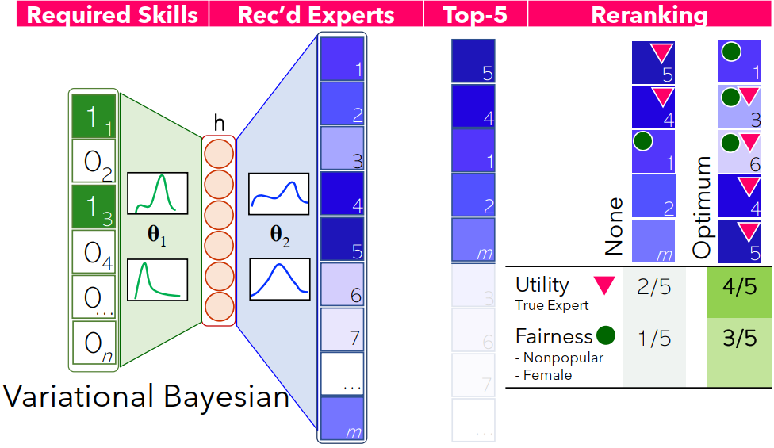
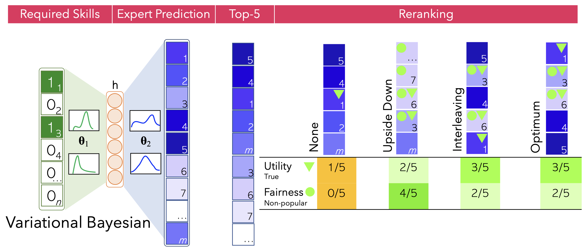
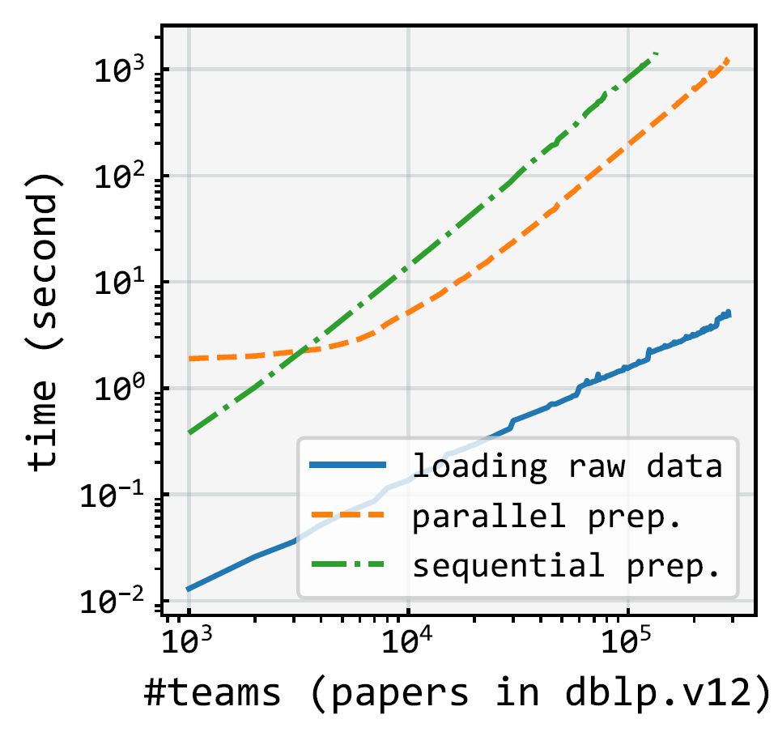
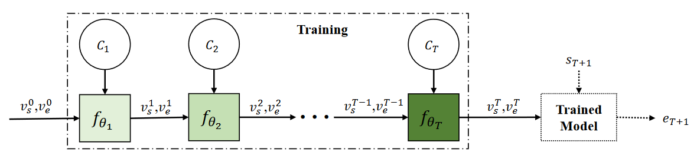
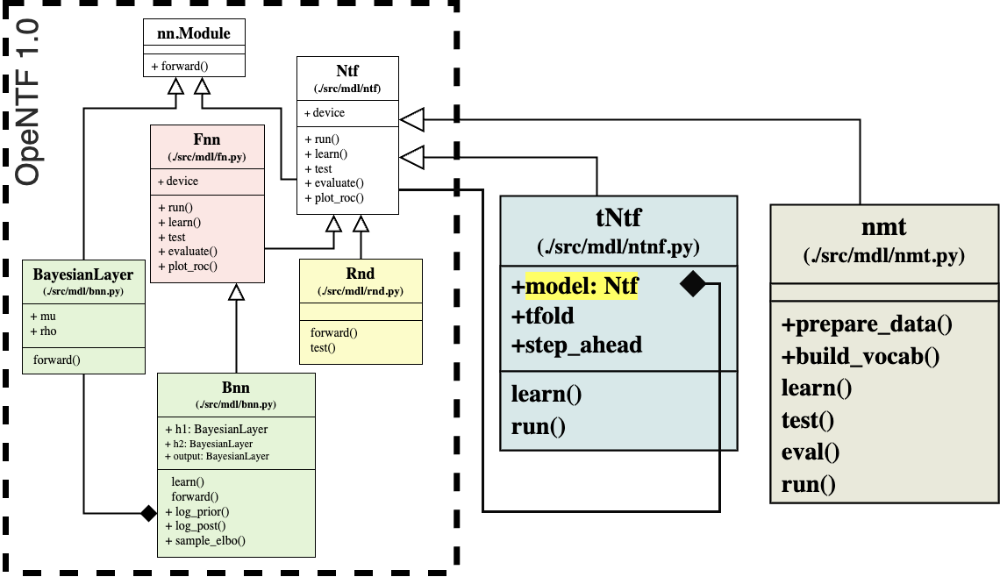
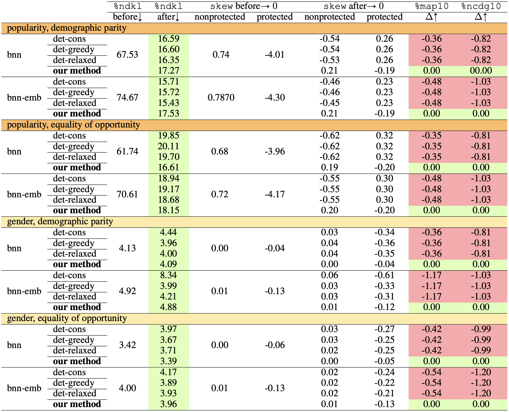
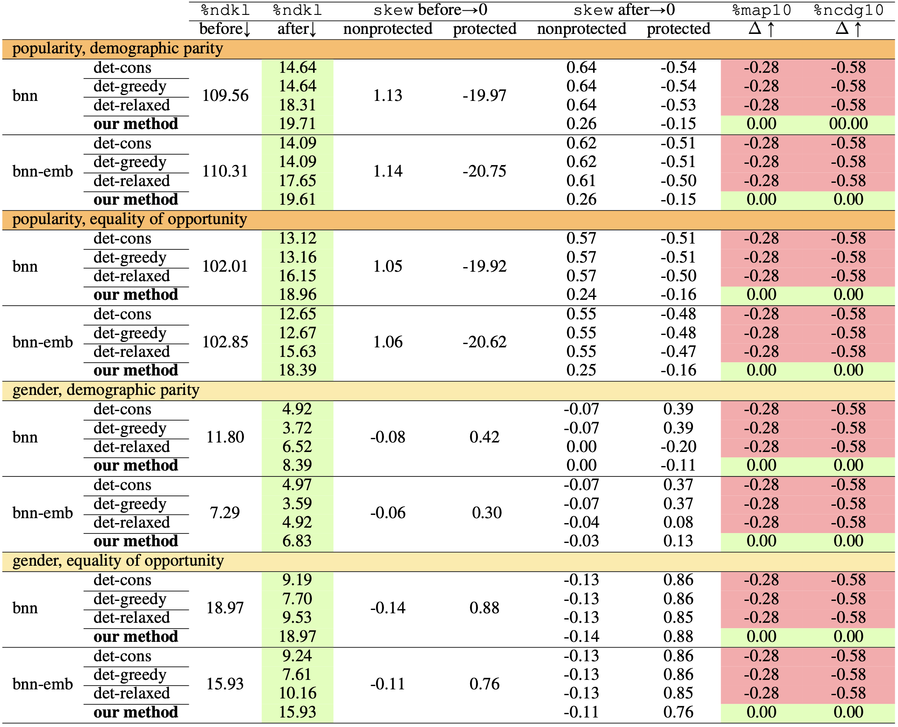
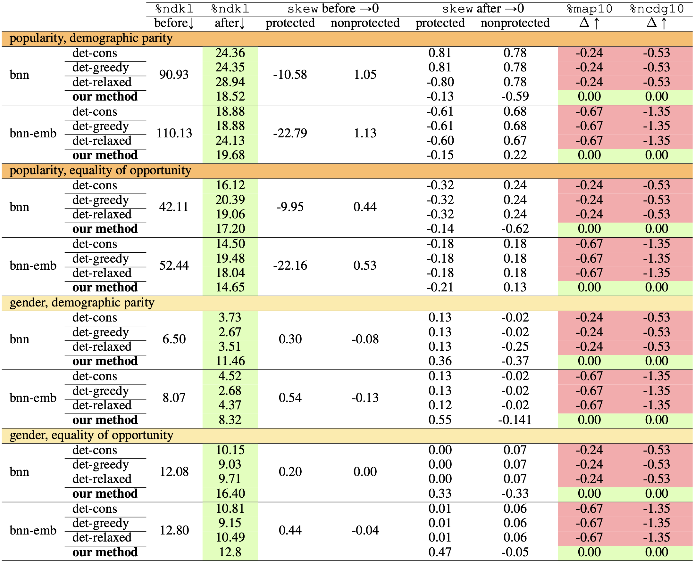
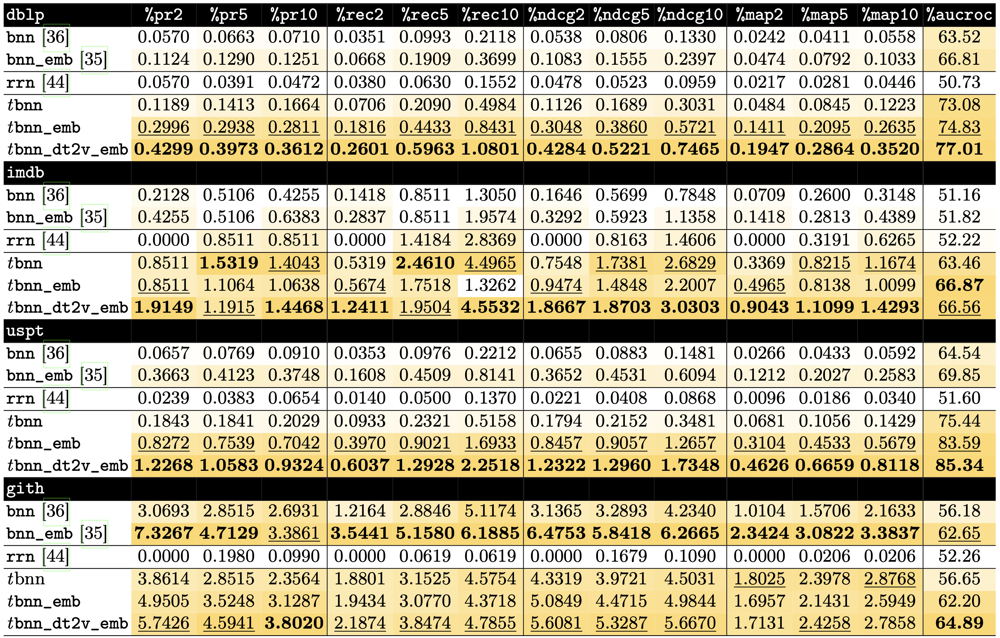

# ``OpeNTF``: An Open-Source Neural Team Formation Benchmark Library 
Team formation (recommendation) involves selecting a team of skillful experts who will, more likely than not, accomplish a task. Researchers have proposed a rich body of computational methods to automate the traditionally tedious and error-prone manual process. We release `OpeNTF`, an open-source neural team formation framework hosting canonical `neural models` as the cutting-edge class of approaches, along with `large-scale` training datasets from `varying domains`. It further includes `temporal` training strategy for neural models’ training to capture the evolution of experts’ skills and collaboration ties over `time`, as opposed to randomly shuffled training datasets. OpeNTF also integrates `debiasing reranking` algorithms at its last step to mitigate the `popularity` and `gender` disparities in the neural models’ team recommendations based on two alternative notions of fairness: `equality of opportunity` and `demographic parity`. OpeNTF is a forward-looking effort to automate team formation via fairness-aware and time-sensitive methods. AI-ML-based solutions are increasingly impacting how resources are allocated to various groups in society, and ensuring fairness and time are systematically considered is key.

<table border=0>
<tr>
<td >

  
- [1. Setup](#1-setup)
- [2. Quickstart](#2-quickstart)
- [3. Features](#3-features)
  * [`Fairness aware Team Formation`](#31-adila-fairness-aware-team-formation)
  * [`Datasets and Parallel Preprocessing`](#32-datasets-and-parallel-preprocessing)
  * [`Non-Temporal Neural Team Formation`](#33-non-temporal-neural-team-formation)
  * [`Temporal Neural Team Prediction`](#34-temporal-neural-team-prediction)
  * [`Model Architecture`](#35-model-architecture)
  * [`Negative Sampling Strategies`](#36-negative-sampling-strategies)
  * [`Run`](#37-run)
- [4. Results](#4-results)
- [5. Acknowledgement](#5-acknowledgement)
- [6. License](#6-license)
- [7. Citation](#7-citation)
- [8. Awards](#8-awards)


</td>
<td></td>
<!-- <td></td> -->
</tr>
</table>


## 1. [Setup](https://colab.research.google.com/github/fani-lab/OpeNTF/blob/main/ipynb/quickstart.ipynb)
`OpeNTF` needs `Python >= 3.8` and installs required packages lazily and on-demand, i.e., as it goes through the steps of the pipeline, it installs a package if the package or the correct version is not available in the environment. For further details, refer to [``requirements.txt``](requirements.txt) and [``pkgmgr.py``](./src/pkgmgr.py). To set up an environment locally:

```sh
#python3.8
python -m venv opentf_venv
source opentf_venv/bin/activate #non-windows
#opentf_venv\Scripts\activate #windows
pip install --upgrade pip
pip install -r requirements.txt
```

For installation of a specific version of a python package due to, e.g., ``CUDA`` versions compatibility, edit [``requirements.txt``](requirements.txt) like:

```
#$ torch==2.4.1 --index-url https://download.pytorch.org/whl/cu118
```

To run in a `container`, a docker `image` can be built and run by customizing the [`Dockerfile`](Dockerfile).

## 2. Quickstart [](https://colab.research.google.com/github/fani-lab/OpeNTF/blob/main/ipynb/quickstart.ipynb)

```sh
cd src
python main.py "cmd=[prep, train, test, eval]" \
               "models.instances=[mdl.rnd.Rnd, mdl.fnn.Fnn, mdl.bnn.Bnn]" \
               data.domain=cmn.publication.Publication data.source=../data/dblp/toy.dblp.v12.json data.output=../output/dblp/toy.dblp.v12.json \
               ~data.filter \
               train.train_test_ratio=0.85 train.nfolds=3 train.save_per_epoch=3 \
               test.per_epoch=True test.topK=100 \
               eval.topk=\'2,5,10\'
```

The above run, loads and preprocesses a tiny-size toy example dataset [``toy.dblp.v12.json``](data/dblp/toy.dblp.v12.json) from [``dblp``](https://originalstatic.aminer.cn/misc/dblp.v12.7z) with `no` filtering followed by `3`-fold cross train-validation on a training split and a final test on the test set for `feedforward` and `Bayesian` neural models as well as a `random` model using default hyperparameters from [`./src/mdl/__config__.yaml`](./src/mdl/__config.yaml). For a step-by-step guide and output trace, see our colab script [](https://colab.research.google.com/github/fani-lab/OpeNTF/blob/main/ipynb/quickstart.ipynb).


## 3. Features
#### **3.1. [`Adila`](https://github.com/fani-lab/Adila): Fairness aware Team Formation**

While state-of-the-art neural team formation methods are able to efficiently analyze massive collections of experts to form effective collaborative teams, they largely ignore the fairness in recommended teams of experts. In `Adila`, we study the application of `fairness-aware` team formation algorithms to mitigate the potential popularity bias in the neural team formation models. We support two fairness notions namely, `equality of opportunity` and `demographic parity`. To achieve fairness, we utilize three deterministic greedy reranking algorithms (`det_greedy`, `det_cons`, `det_relaxed`) in addition to `fa*ir`, a probabilistic greedy reranking algorithm . 


<p align="center"></p>


For further details and demo, please visit [Adila's submodule](https://github.com/fani-lab/Adila).

#### **3.2. Datasets and Parallel Preprocessing**

Raw dataset, e.g., scholarly papers from AMiner's citation network dataset of [``dblp``](https://originalstatic.aminer.cn/misc/dblp.v12.7z), movies from [``imdb``](https://datasets.imdbws.com/), or US patents from [``uspt``](https://patentsview.org/download/data-download-tables) were assumed to be populated in [``data/raw``](data/raw). For the sake of integration test, tiny-size toy example datasets [``toy.dblp.v12.json``](data/raw/dblp/toy.dblp.v12.json) from [``dblp``](https://originalstatic.aminer.cn/misc/dblp.v12.7z), [[``toy.title.basics.tsv``](data/raw/imdb/toy.title.basics.tsv), [``toy.title.principals.tsv``](data/raw/imdb/toy.title.principals.tsv), [``toy.name.basics.tsv``](data/raw/imdb/toy.name.basics.tsv)] from [``imdb``](https://datasets.imdbws.com/) and [``toy.patent.tsv``](data/preprocessed/uspt/toy.patent.tsv) have been already provided.

<p align="center"></p>

Raw data will be preprocessed into two main ``sparse`` matrices each row of which represents: 

>i) ``vecs['member']``: occurrence (boolean) vector representation for members of a team, e.g., authors of a paper or crew members of a movie,
> 
>ii) ``vecs['skill']``: occurrence (boolean) vector representation for required skills for a team, e.g., keywords of a paper or genre of a movie.

Also, indexes will be created to map the vector's indexes to members' names and skills' names, i.e., ``i2c``, ``c2i``, ``i2s``, ``s2i``.

The sparse matrices and the indices will be persisted in [``data/preprocessed/{dblp,imdb,uspt}/{name of dataset}``](data/preprocessed/) as pickles ``teamsvecs.pkl`` and ``indexes.pkl``. For example, the preprocessed data for our dblp toy example are [``data/preprocessed/dblp/toy.dblp.v12.json/teamsvecs.pkl``](data/preprocessed/dblp/toy.dblp.v12.json/teams.pkl) and [``data/preprocessed/dblp/toy.dblp.v12.json/indexes.pkl``](data/preprocessed/dblp/toy.dblp.v12.json/indexes.pkl).

> Our pipeline benefits from parallel generation of sparse matrices for teams that significantly reduces the preprocessing time as shown below:
> 
> <p align="center"></p>


Please note that the preprocessing step will be executed once. Subsequent runs load the persisted pickle files. In order to regenerate them, one should simply delete them. 


#### **3.3. Non-Temporal Neural Team Formation**

We randomly take ``85%`` of the dataset for the train-validation set and ``15%`` as the test set, i.e., the model never sees these instances during training or model tuning. You can change ``train_test_split`` parameter in [``./src/param.py``](./src/param.py).

#### **3.4. Temporal Neural Team Prediction**

Previous works in team formation presumed that teams follow the i.i.d property and hence when training their models they followed the bag of teams approach, where they train and validate their models on a shuffled dataset of teams. Moreover, they were interpolative and did not try to predict _future_ successful teams. In this work, we aim at extrapolating and predicting _future_ teams of experts. We sort the teams by time intervals and train a neural model incrementally  through the ordered collection of teams in [C<sub>0</sub>, ..C<sub>t</sub>, ..C<sub>T</sub>]. As can be seen in Figure below, after random initialization of skills’ and experts’ embeddings at t=0, we start training the model on the teams in the first time interval C<sub>0</sub> for a number of epochs, then we continue with training  on the second time interval C<sub>1</sub> using the learned embeddings from the previous time interval and so forth until we finish the training on the last training time interval C<sub>t=T</sub>. We believe that using this approach, will help the model understand how experts’ skills and collaborative ties evolve through time and the final embeddings are their optimum representation in the latent space to predict _future_ successful teams at time interval C<sub>t=T+1</sub>.

<p align="center"></p>


#### **3.5. Model Architecture**

Each model has been defined in [``./src/mdl/``](./src/mdl/) under an inheritance hierarchy. They override abstract functions for ``train``, ``test``, ``eval``, and ``plot`` steps.

For example, for our feedforward baseline [``fnn``](./src/mdl/fnn.py), the model has been implemented in [``./src/mdl/fnn.py``](src/mdl/fnn.py). Model's hyperparameters such as the learning rate (``lr``) or the number of epochs (``e``) can be set in [``./src/param.py``](src/param.py).


<p align="center"></p>
  
Currently, we support neural models:
1) Bayesian [``bnn``](./src/mdl/bnn.py) where model's parameter (weights) is assumed to be drawn from Gaussian (Normal) distribution and the task is to not to learn the weight but the mean (μ) and standard deviation (σ) of the distribution at each parameter.

<p align="center"></p>

2) non-Bayesian feedforward [``fnn``](./src/mdl/fnn.py) where the model's parameter (weights) is to be learnt.

The input to the models is the vector representations for (_temporal_) skills and the output is the vector representation for members. In another word, given the input skills, the models predict the members from the pool of candidates. We support three vector representations:

i) Sparse vector representation (occurrence or boolean vector): See preprocessing section above.

ii) Dense vector representation ([``team2vec``](src/mdl/team2vec/team2doc2vec.py)): Inspired by paragraph vectors by [Le and Mikolov](https://cs.stanford.edu/~quocle/paragraph_vector.pdf), we consider a team as a document and skills as the document words (``embtype == 'skill'``). Using distributed memory model, we map skills into a real-valued embedding space. Likewise and separately, we consider members as the document words and map members into real-valued vectors (``embtype == 'member'``). We also consider mapping skills and members into the same embedding space (``embtype == 'joint'``). Our embedding method benefits from [``gensim``](https://radimrehurek.com/gensim/) library.

iii) Temporal skill vector represntation ([``team2vec``](src/mdl/team2vec/team2doc2vec.py)): Inspired by [Hamilton et al.](https://aclanthology.org/P16-1141/), we also incorporate time information into the underlying neural model besides utilizing our proposed streaming training strategy. We used the distributed memory model of Doc2Vec to generate the real-valued joint embeddings of the subset of skills and time intervals, where the skills and time intervals are the words of the document (``embtype == 'dt2v'``).

3) In OpeNTF2, The ``Nmt`` wrapper class is designed to make use of advanced transformer models and encoder-decoder models that include multiple ``LSTM`` or ``GRU`` cells, as well as various attention mechanisms. ``Nmt`` is responsible for preparing the necessary input and output elements and invokes the executables of ``opennmt-py`` by creating a new process using Python's ``subprocess`` module. Additionally, because the ``Nmt`` wrapper class inherits from ``Ntf``, these models can also take advantage of temporal training strategies through ``tNtf``.

#### **3.6. Negative Sampling Strategies**

As known, employing ``unsuccessful`` teams convey complementary negative signals to the model to alleviate the long-tail problem. Most real-world training datasets in the team formation domain, however, do not have explicit unsuccessful teams (e.g., collections of rejected papers.) In the absence of unsuccessful training instances, we proposed negative sampling strategies based on the ``closed-world`` assumption where no currently known successful group of experts for the required skills is assumed to be unsuccessful.  We study the effect of ``three`` different negative sampling strategies: two based on static distributions, and one based on adaptive noise distribution:

1) Uniform distribution (``uniform``), where subsets of experts are randomly chosen with the ``same probability`` as unsuccessful teams from the uniform distribution over all subsets of experts.

2) Unigram distribution (``unigram``), where subsets of experts are chosen regarding ``their frequency`` in all previous successful teams. Intuitively, teams of experts that have been more successful but for other skill subsets will be given a higher probability and chosen more frequently as a negative sample to dampen the effect of popularity bias.

3) Smoothed unigram distribution in each training minibatch (``unigram_b``), where we employed the ``add-1 or Laplace smoothing`` when computing the unigram distribution of the experts but in each training minibatch. Minibatch stochastic gradient descent is the _de facto_ method for neural models where the data is split into batches of data, each of which is sent to the model for the partial calculation to speed up training while maintaining high accuracy. 

To include a negative sampling strategy, there are two parameters for a model to set in [``./src/param.py``](src/param.py):
- ``ns``: the negative sampling strategy which can be ``uniform``, ``unigram``, ``unigram_b`` or ``None``(no negative sampling).
- ``nns``: number of negative samples

#### **3.7. Run**

The pipeline accepts three required list of values:
1) ``-data``: list of path to the raw datafiles, e.g., ``-data ./../data/raw/dblp/dblp.v12.json``, or the main file of a dataset, e.g., ``-data ./../data/raw/imdb/title.basics.tsv``
2) ``-domain``: list of domains of the raw data files that could be ``dblp``, ``imdb``, or `uspt`; e.g., ``-domain dblp imdb``.
3) ``-model``: list of baseline models that could be ``fnn``, ``fnn_emb``, ``bnn``, ``bnn_emb``, ``tfnn``, ``tfnn_emb``, ``tfnn_dt2v_emb``, ``tbnn``, ``tbnn_emb``, ``tbnn_dt2v_emb``, ``random``; e.g., ``-model random fnn bnn tfnn tbnn tfnn_dt2v_emb tbnn_dt2v_emb``.

Here is a brief explanation of the models:
- ``fnn``, ``bnn``, ``fnn_emb``, ``bnn_emb``: follows the standard machine learning training procedure.
- ``tfnn``, ``tbnn``, ``tfnn_emb``, ``tbnn_emb``: follows our proposed streaming training strategy without adding temporal information to the input of the models.
- ``tfnn_dt2v_emb``, ``tbnn_dt2v_emb``: follows our proposed streaming training strategy and employs temporal skills as input of the models.

## 4. Results

We used [``pytrec_eval``](https://github.com/cvangysel/pytrec_eval) to evaluate the performance of models on the test set as well as on their own train sets (should overfit) and validation sets. We report the predictions, evaluation metrics on each test instance, and average on all test instances in ``./output/{dataset name}/{model name}/{model's running setting}/``.  For example:

1) ``f0.test.pred`` is the predictions per test instance for a model which is trained folds [1,2,3,4] and validated on fold [0].
2) ``f0.test.pred.eval.csv`` is the values of evaluation metrics for the predictions per test instance
3) ``f0.test.pred.eval.mean.csv`` is the average of values for evaluation metrics over all test instances.
4) ``test.pred.eval.mean.csv`` is the average of values for evaluation metrics over all _n_ fold models.

**Benchmarks at Scale**

**1. Fair Team Formation Results**
||min. #member's team: 75, min team size: 3, epochs: 20, learning rate: 0.1, hidden layer: [1, 100d], minibatch: 4096, #negative samples: 3|
|--------|------|
|Datasets|[dblp.v12](https://originalstatic.aminer.cn/misc/dblp.v12.7z), [imdb](https://imdb.com/interfaces/), [uspt](https://patentsview.org/download/data-download-tables) (running ...)|
|Metrics|ndkl, map@2,5,10, ndcg@2,5,10, auc|
|Sensitive Attributes| popularity, gender(running ...)|
|Baselines|{bnn, random}×{sparse, emb}×{unigram_b}|
|Results|for further details and results, please visit [Adila's submodule](https://github.com/fani-lab/Adila)|

Average performance of 5-fold neural models on the test set of the `imdb`, `dblp` and `uspt` datasets. For the metrics: `ndkl`, lower values are better (↓); `skew`, values closer to 0 are better (→0); and `map` and `ndcg`, higher values are better (↑).
<hr>
imdb dataset
<p align="center"></p>
<hr>
dblp table
<p align="center"></p>
<hr>
uspt table
<p align="center"></p>

**2. Non-Temporal Neural Team Formation**

||min. #member's team: 75, min team size: 3, epochs: 20, learning rate: 0.1, hidden layer: [1, 100d], minibatch: 4096, #negative samples: 3|
|--------|------|
|Datasets|[dblp.v12](https://originalstatic.aminer.cn/misc/dblp.v12.7z), [imdb](https://imdb.com/interfaces/), [uspt](https://patentsview.org/download/data-download-tables)|
|Metrics|recall@2,5,10, map@2,5,10, ndcg@2,5,10, p@2,5,10, auc|
|Baselines|{fnn,bnn}×{sparse, emb}×{none, uniform, unigram, unigram_b}|
|Results|[``./output/dblp.v12.json.filtered.mt75.ts3/``](./output/dblp.v12.json.filtered.mt75.ts3/), [``./output/title.basics.tsv.filtered.mt75.ts3/``](./output/title.basics.tsv.filtered.mt75.ts3/)|

<p align="center">


Full predictions of all models on test and training sets and the values of evaluation metrics, per instance and average, are available in a rar file of size ``74.8GB`` and will be delivered upon request! 

**3. Temporal Neural Team Prediction**

We kick-started our experiments based on the best results from the non-temporal neural team formation experiments.

||min. #member's team: 75, min team size: 3, epochs: 20, learning rate: 0.1, hidden layer: [1, 128d], minibatch: 128, #negative samples: 3|
|--------|------|
|Datasets|[dblp.v12](https://originalstatic.aminer.cn/misc/dblp.v12.7z), [imdb](https://imdb.com/interfaces/), [uspt](https://patentsview.org/download/data-download-tables), [gith](https://codelabs.developers.google.com/codelabs/bigquery-github#0)|
|Metrics|recall@2,5,10, map@2,5,10, ndcg@2,5,10, p@2,5,10, auc|
|Baselines|{bnn, tbnn}×{sparse, emb, dt2v_emb}×{unigram_b},{[rrn](https://dl.acm.org/doi/10.1145/3018661.3018689)}|
|Results|[``./output/dblp.v12.json.filtered.mt75.ts3/``](./output/dblp.v12.json.filtered.mt75.ts3/), [``./output/title.basics.tsv.filtered.mt75.ts3/``](./output/title.basics.tsv.filtered.mt75.ts3/), [``./output/patent.tsv.filtered.mt75.ts3/``](./output/patent.tsv.filtered.mt75.ts3/)|

<p align="center"></p>

Full predictions of all models on test and training sets and the values of evaluation metrics are available in a rar file and will be delivered upon request! 


## 5. Acknowledgement:
We benefit from [``pytrec_eval``](https://github.com/cvangysel/pytrec_eval), [``gensim``](https://radimrehurek.com/gensim/), [Josh Feldman's blog](https://joshfeldman.net/WeightUncertainty/), and other libraries. We would like to thank the authors of these libraries and helpful resources.
  
## 6. License:
©2024. This work is licensed under a [CC BY-NC-SA 4.0](license.txt) license.

## 7. Citation:
```
@inproceedings{DBLP:conf/ecir/FaniBDS24,
  author       = {Hossein Fani and Reza Barzegar and Arman Dashti and Mahdis Saeedi},
  title        = {A Streaming Approach to Neural Team Formation Training},
  booktitle    = {Advances in Information Retrieval - 46th European Conference on Information Retrieval, {ECIR} 2024, Glasgow, UK, March 24-28, 2024, Proceedings, Part {I}},
  series       = {Lecture Notes in Computer Science},
  volume       = {14608},
  pages        = {325--340},
  publisher    = {Springer},
  year         = {2024},
  url          = {https://doi.org/10.1007/978-3-031-56027-9\_20},
  doi          = {10.1007/978-3-031-56027-9\_20},
  biburl       = {https://dblp.org/rec/conf/ecir/FaniBDS24.bib},
  bibsource    = {dblp computer science bibliography, https://dblp.org}
}
  ```

```
@inproceedings{DBLP:conf/cikm/DashtiSF22,
  author    = {Arman Dashti and Saeed Samet and Hossein Fani},
  title     = {Effective Neural Team Formation via Negative Samples},
  booktitle = {Proceedings of the 31st {ACM} International Conference on Information {\&} Knowledge Management, Atlanta, GA, USA, October 17-21, 2022},
  pages     = {3908--3912},
  publisher = {{ACM}},
  year      = {2022},
  url       = {https://doi.org/10.1145/3511808.3557590},
  doi       = {10.1145/3511808.3557590},
  biburl    = {https://dblp.org/rec/conf/cikm/DashtiSF22.bib},
  bibsource = {dblp computer science bibliography, https://dblp.org}
}
  ```
  ```
@inproceedings{DBLP:conf/cikm/DashtiSPF22,
  author    = {Arman Dashti and Karan Saxena and Dhwani Patel and Hossein Fani},
  title     = {OpeNTF: {A} Benchmark Library for Neural Team Formation},
  booktitle = {Proceedings of the 31st {ACM} International Conference on Information {\&} Knowledge Management, Atlanta, GA, USA, October 17-21, 2022},
  pages     = {3913--3917},
  publisher = {{ACM}},
  year      = {2022},
  url       = {https://doi.org/10.1145/3511808.3557526},
  doi       = {10.1145/3511808.3557526},
  biburl    = {https://dblp.org/rec/conf/cikm/DashtiSPF22.bib},
  bibsource = {dblp computer science bibliography, https://dblp.org}
}
```

## 8. Awards:

> [CAD$300, Gold medalist, UWill Discover, 2022](https://scholar.uwindsor.ca/uwilldiscover/2022/2022Day3/30/)

> CAD$300, Best Research, Demo Day, School of Computer Science, University of Windsor, 2022. 
