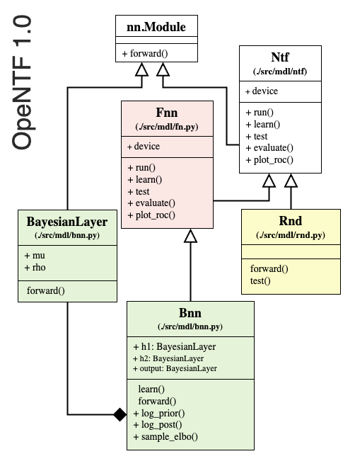
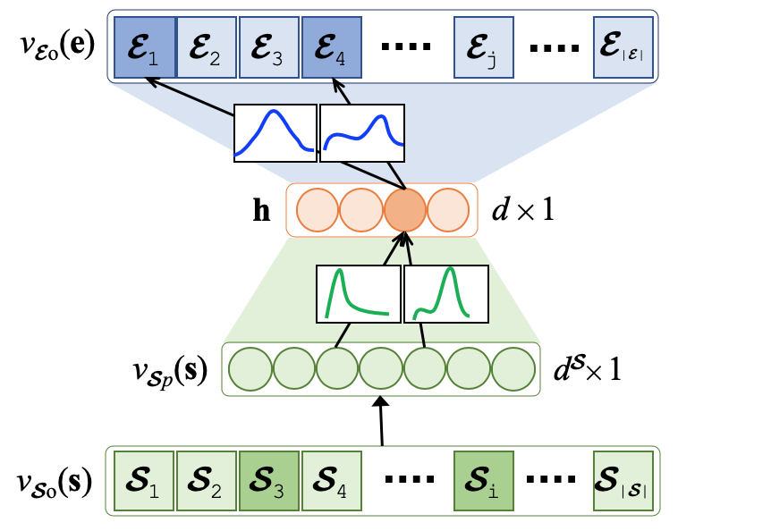
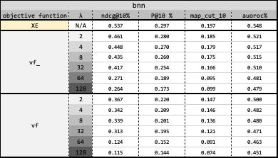
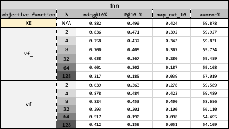
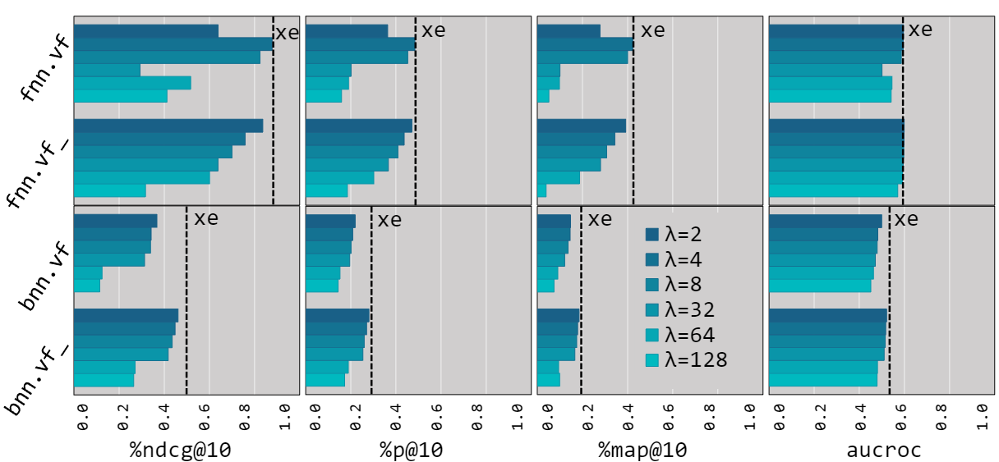
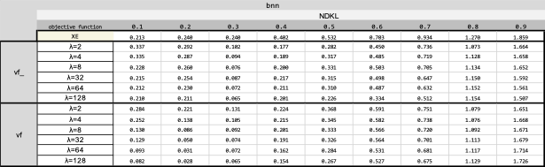
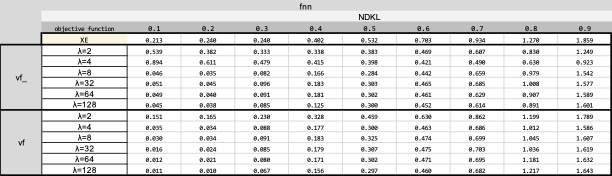

# <p align="left"></p> Mitigating Gender Bias in Neural Team Recommendation via Female-Advocate Loss Regularization


The process of team recommendation, also known as team formation, automates the creation of expert groups whose collective skills address complex challenges. This process can be considered a form of social information retrieval (Social IR), where the goal is to assemble the right team of experts, rather than to find relevant information, to complete a given task. Historically, and still prevalent in many sectors, team formation has been a manual process reliant on human judgment and intuition. This method is often laborious, prone to errors, and less than ideal due to unseen personal and societal biases, a plethora of optimization criteria, and a vast pool of potential candidates. Moreover, team formation is significantly shaped by subjective opinions that perpetuate existing societal biases, often overlooking diversity in team recommendations. This leads to discriminatory practices and diminished opportunities for underrepresented groups such as women, resulting in a skewed selection favoring male experts and contributing to ongoing gender disparities.

<table border=0>
<tr>
<td >

  
- [1. Setup](#1-setup)
- [2. Quickstart](#2-quickstart)
- [3. Features](#3-features)
  * [`Non-Temporal Neural Team Formation`](#31-non-temporal-neural-team-formation)
  * [`Model Architecture`](#32-model-architecture)
  * [`Negative Sampling Strategies`](#33-negative-sampling-strategies)
  * [`Run`](#34-run)
- [4. Results](#4-results)
- [5. Acknowledgement](#5-acknowledgement)


</td>
<td></td>
<!-- <td></td> -->
</tr>
</table>


## 1. Setup

You need to have ``Python >= 3.8`` and install the following main packages, among others listed in [``requirements.txt``](requirements.txt):
```
torch>=1.9.0
pytrec-eval-terrier==0.5.2
gensim==3.8.3
```

For installation of specific version of a python package due to, e.g., ``CUDA`` versions compatibility, one can edit [``requirements.txt``](requirements.txt) or [``environment.yml``](environment.yml) like as follows:

```
# CUDA 10.1
torch==1.6.0+cu101 -f https://download.pytorch.org/whl/torch_stable.html
```
You can download the repository from the right top corner of the page (There are some inconsistencies between the anonymous page and the actual GitHub page of the project. These discrepancies are due to the need to keep the page and its links anonymous. They will be made consistent upon acceptance of the paper).
## 2. Quickstart

```sh
cd src
python -u main.py -data ../data/raw/imdb/toy.title.basics.tsv -domain imdb -model fnn (or bnn) -filter 1 -augment 1

```

The above run, loads and preprocesses a tiny-size toy example dataset [`/toy.title.basics.tsv``](data/raw/imdb/toy.title.basics.tsvn) from [``imdb``] followed by _n_-fold train-evaluation on a training split and final test on the test set for ``feedforward`` and ``Bayesian`` neural models using default hyperparameters from [``./src/param.py``](./src/param.py). To change the loss function that the model uses, from [``./src/param.py``](./src/param.py) change the hyperparameter ns to 'vf' or 'vf_' in the models's setting(fnn,bnn) and for training the model with the cross-entropy loss function replace it with 'none'.

```
python -u main.py -data ../data/raw/imdb/toy.title.basics.tsv -domain imdb -model fnn (or bnn) -filter 1 -augment 1
```

## 3. Features

#### **3.1. vivaFemme

Neural team recommendation has significantly improved both the efficacy and efficiency of assembling expert teams capable of successfully tackling complex tasks. However, these methods often fail to account for diversity, resulting in teams that are predominantly male with minimal female involvement. Initial efforts to address this issue have included pre- and post-processing debiasing techniques, which are attractive for their model-agnostic nature and minimal architectural changes. Yet, these methods have shown limited effectiveness in combating severe biases, highlighting the need for more robust in-process debiasing strategies. In this paper, we are the first to propose an in-process gender debiasing approach for neural team recommendations by innovatively modifying the standard cross-entropy loss function. Specifically, (1) we dramatically penalize the model (i.e., an increase to the loss) for false negative female experts, and meanwhile, (2) we randomly sample from female experts and reinforce the likelihood of female participation in the predicted teams, even at the cost of increasing false positive females.
<p align="center"></p>


#### **3.2. Non-Temporal Neural Team Formation**

We randomly take ``85%`` of the dataset for the train-validation set and ``15%`` as the test set, i.e., the model never sees these instances during training or model tuning. You can change ``train_test_split`` parameter in [``./src/param.py``](./src/param.py).


#### **3.3. Model Architecture**

Each model has been defined in [``./src/mdl/``](./src/mdl/) under an inheritance hierarchy. They override abstract functions for ``train``, ``test``, ``eval``, and ``plot`` steps.

For example, for our feedforward baseline [``fnn``](./src/mdl/fnn.py), the model has been implemented in [``./src/mdl/fnn.py``](src/mdl/fnn.py). Model's hyperparameters such as the learning rate (``lr``) or the number of epochs (``e``) can be set in [``./src/param.py``](src/param.py).


<p align="center"></p>
  
Currently, we support neural models:
1) Bayesian [``bnn``](./src/mdl/bnn.py) where model's parameter (weights) is assumed to be drawn from Gaussian (Normal) distribution and the task is to not to learn the weight but the mean (μ) and standard deviation (σ) of the distribution at each parameter.

<p align="center"></p>

2) non-Bayesian feedforward [``fnn``](./src/mdl/fnn.py) where the model's parameter (weights) is to be learnt.

The input to the models is the vector representations for (_temporal_) skills and the output is the vector representation for members. In another word, given the input skills, the models predict the members from the pool of candidates. 

#### **3.4. Negative Sampling Strategies**

We compare the impact of our proposed loss function on mitigating the gender bias of two reference neural architectures: (1) feed-forward non-Bayesian (non-variational) neural network and (2) the-state-of-the-art Bayesian (variational) neural network. Both models include a single hidden layer of size d=128 and leaky relu is the activation function for the hidden layer. For the input layer, we used sparse occurrence vector representations (multi-hot encoded) of skills of size $|\mathcal{S}|$. The output layer is the sparse occurrence vector representations (multi-hot encoded) of experts of size $|\mathcal{E}|$. We trained the neural models using the binary cross-entropy xe as the biased baseline, vivaFemme without random samplings of female experts vf_, and vivaFemme with random sampling vf of $k=|\mathcal{G}_f|$ female experts from $\mathbb{P}= uniform distribution for increasing punitive coefficients.

#### **3.5. Run**

The pipeline accepts three required list of values:
1) ``-data``: the main file of a dataset, e.g., ``-data ./../data/raw/imdb/title.basics.tsv``
2) ``-domain``: list of domains of the raw data files that could be  ``imdb``; e.g., ``-domain imdb``.
3) ``-model``: list of baseline models that could be ``fnn``, ``bnn``; e.g., ``-model fnn bnn``.


## 4. Results

We used [``pytrec_eval``](https://github.com/cvangysel/pytrec_eval) to evaluate the performance of models on the test set as well as on their own train sets (should overfit) and validation sets. We report the predictions, evaluation metrics on each test instance, and average on all test instances in ``./output/{dataset name}/{model name}/{model's running setting}/``.  For example:

1) ``f0.test.pred`` is the predictions per test instance for a model which is trained folds [1,2,3,4] and validated on fold [0].
2) ``f0.test.pred.eval.csv`` is the values of evaluation metrics for the predictions per test instance
3) ``f0.test.pred.eval.mean.csv`` is the average of values for evaluation metrics over all test instances.
4) ``test.pred.eval.mean.csv`` is the average of values for evaluation metrics over all _n_ fold models.

**Benchmarks at Scale**

**1. Fair Team Formation Results**
||min. #member's team: 75, min team size: 3, epochs: 20, learning rate: 0.1, hidden layer: [1, 100d], minibatch: 4096, #negative samples: 3|
|--------|------|
|Datasets| [imdb](https://imdb.com/interfaces/)|
|Metrics|ndkl, map@2,5,10, ndcg@2,5,10, auc|
|Sensitive Attributes| gender|
|Baselines|{bnn, fnn}|

The following table is the results of vivaFemme on imdb dataset and bnn and fnn embedding baseline:

<p align="center"></p>
<p align="center"></p>

<p align="center">
    
</p>

<p align="center"></p>
<p align="center"></p>


## 5. Acknowledgement:
We benefit from [``pytrec_eval``](https://github.com/cvangysel/pytrec_eval), [``gensim``](https://radimrehurek.com/gensim/), [Josh Feldman's blog](https://joshfeldman.net/WeightUncertainty/), and other libraries. We would like to thank the authors of these libraries and helpful resources.
